# 🎨 Mermaid Diagrams Showcase

> ✨ **Welcome to the ultimate Mermaid & Docusaurus feature showcase!** ✨

This page demonstrates the power of **Mermaid diagrams** combined with Docusaurus' rich markdown capabilities. Get ready for a visual feast! 🚀

---

## 📊 Overview Dashboard

| Feature | Status | Complexity | Coolness Factor |
|---------|--------|------------|-----------------|
| 📈 Flowcharts | ✅ Active | ⭐⭐ | 🔥🔥🔥 |
| 🔄 Sequence Diagrams | ✅ Active | ⭐⭐⭐ | 🔥🔥🔥🔥 |
| 🏗️ Class Diagrams | ✅ Active | ⭐⭐⭐⭐ | 🔥🔥🔥 |
| 📅 Gantt Charts | ✅ Active | ⭐⭐ | 🔥🔥 |
| 🥧 Pie Charts | ✅ Active | ⭐ | 🔥🔥🔥 |
| 🔀 State Diagrams | ✅ Active | ⭐⭐⭐ | 🔥🔥🔥🔥 |
| 🗺️ ER Diagrams | ✅ Active | ⭐⭐⭐⭐ | 🔥🔥🔥 |
| 🧠 Mind Maps | ✅ Active | ⭐⭐ | 🔥🔥🔥🔥🔥 |

---

## 🌊 Flowchart Diagrams

### 🎯 Basic User Journey

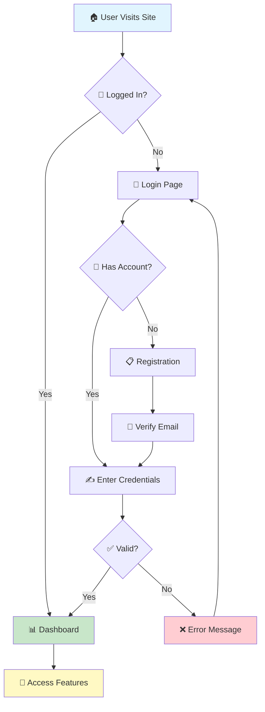

### 🔧 System Architecture

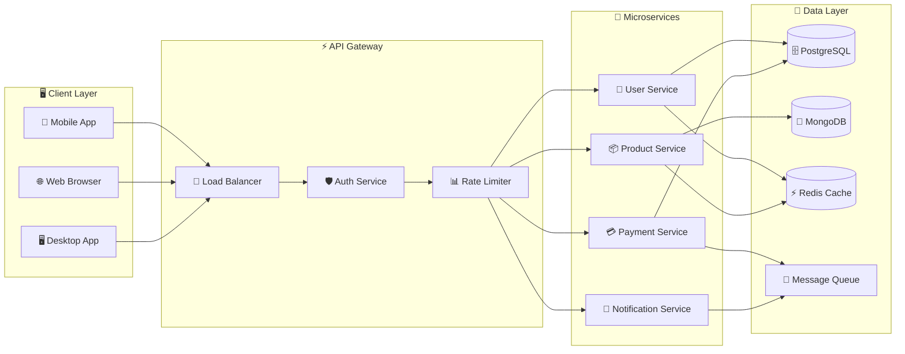

---

## 🔄 Sequence Diagrams

### 🛒 E-Commerce Checkout Flow

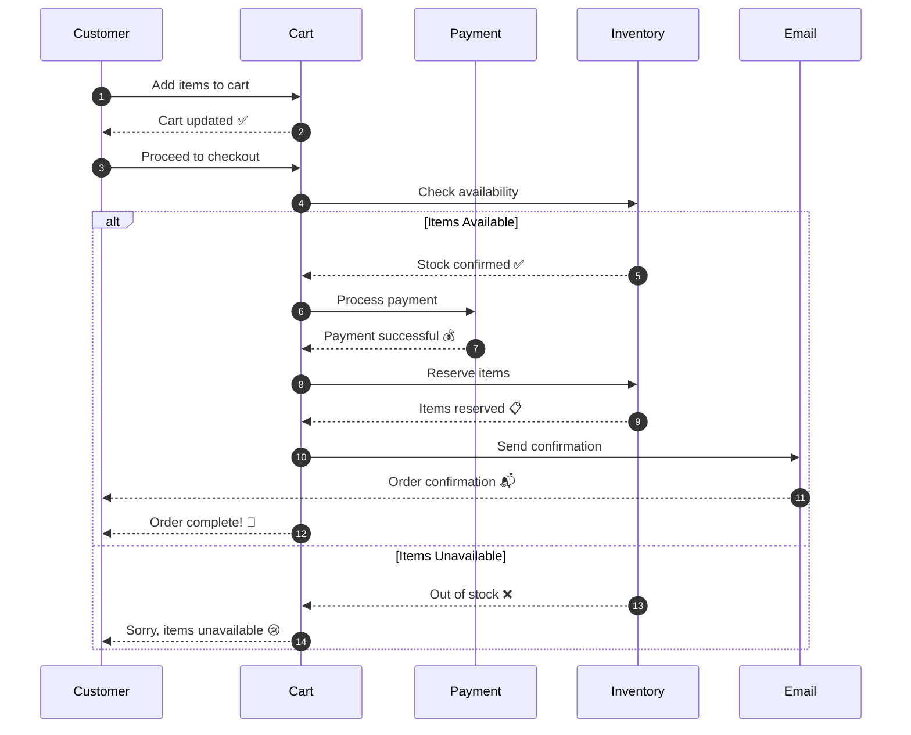

### 🔐 OAuth 2.0 Authentication

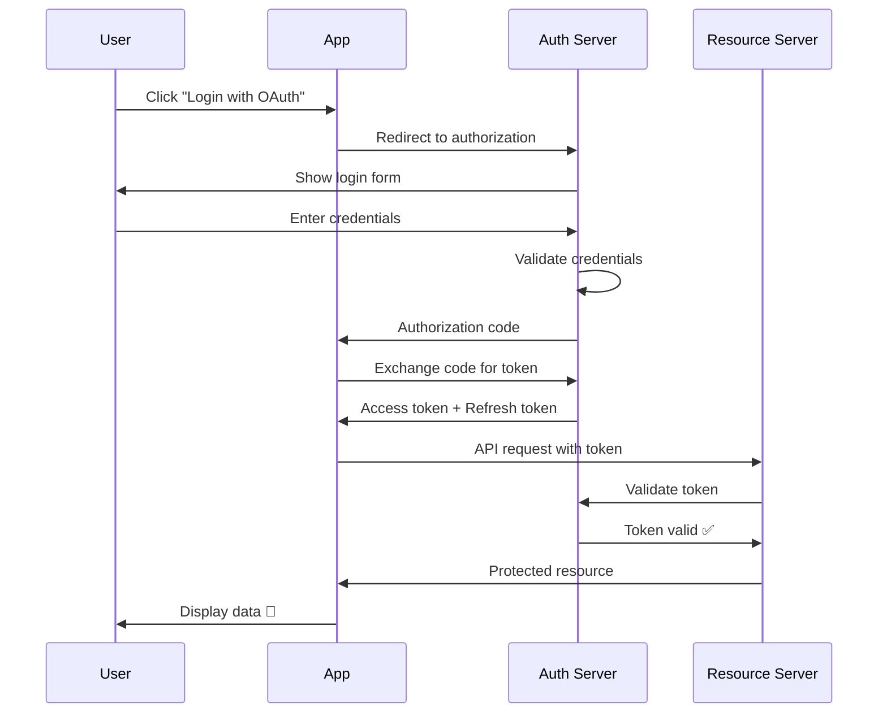

---

## 🏗️ Class Diagrams

### 📚 Library Management System

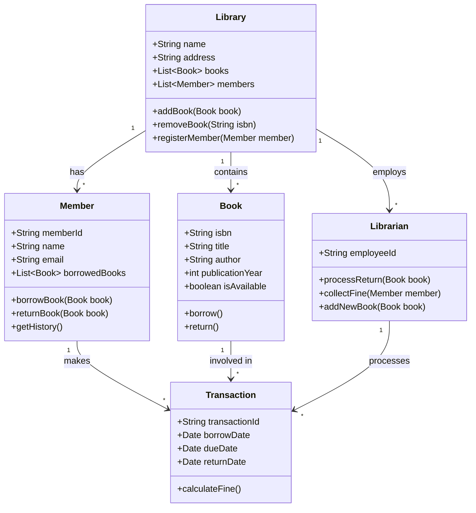

---

## 🔀 State Diagrams

### 📝 Document Lifecycle

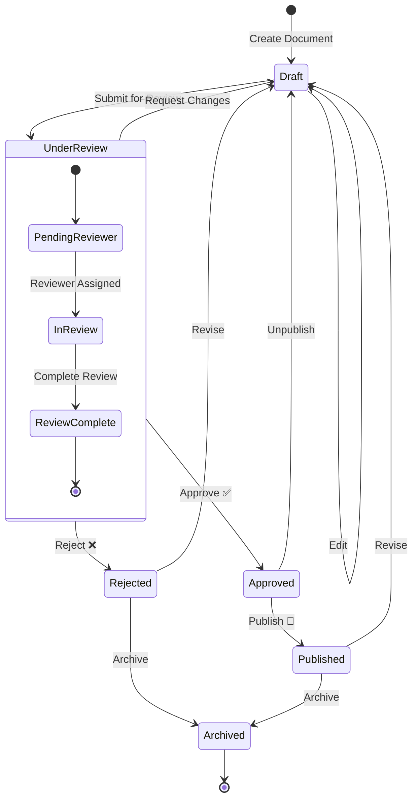

### 🎮 Game Character States

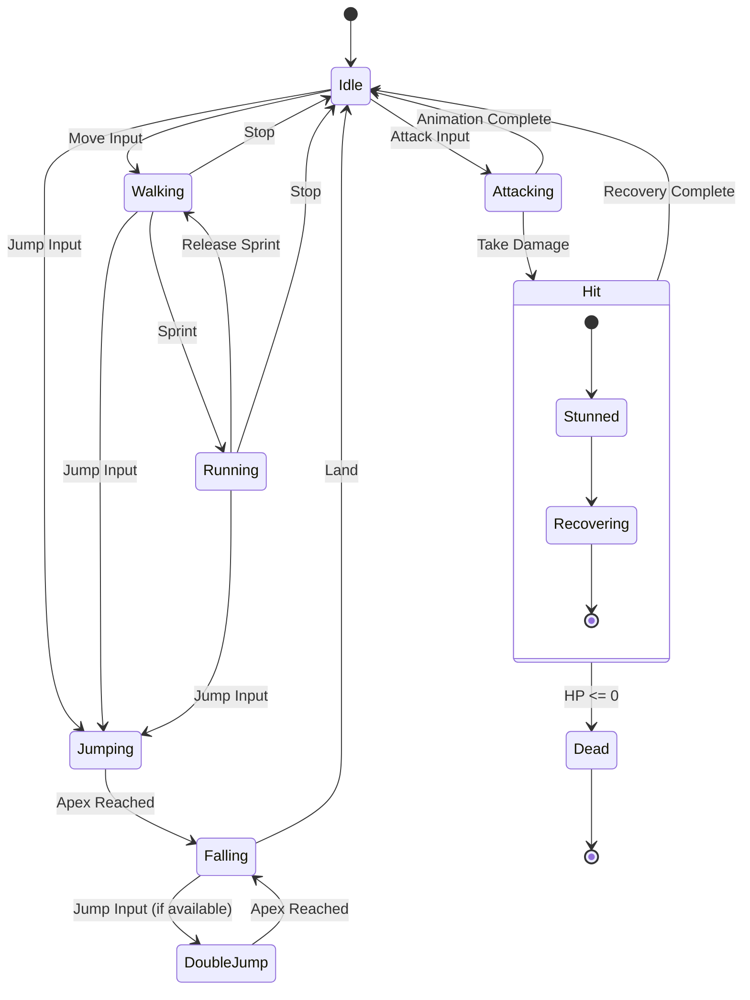

---

## 🗺️ Entity Relationship Diagrams

### 🛍️ E-Commerce Database

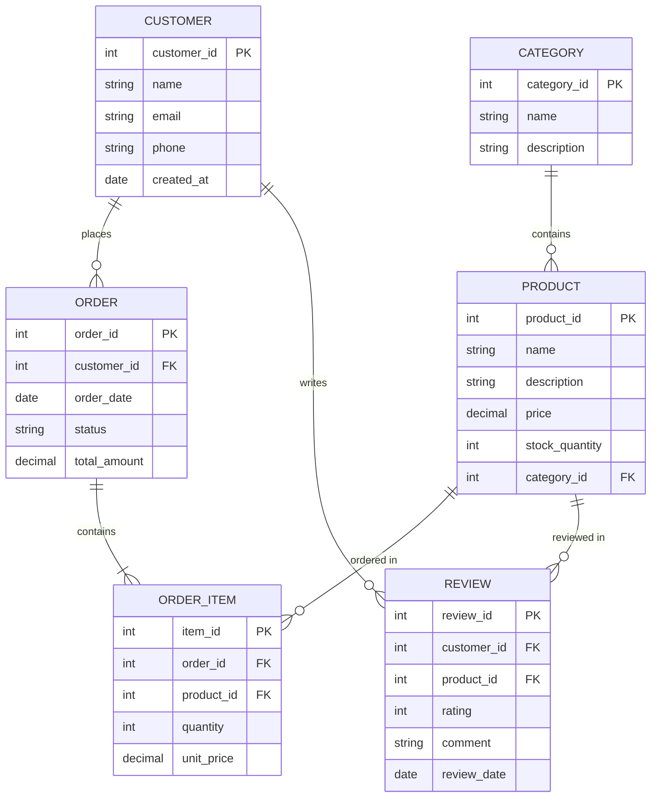

---

## 📅 Gantt Charts

### 🚀 Product Launch Timeline

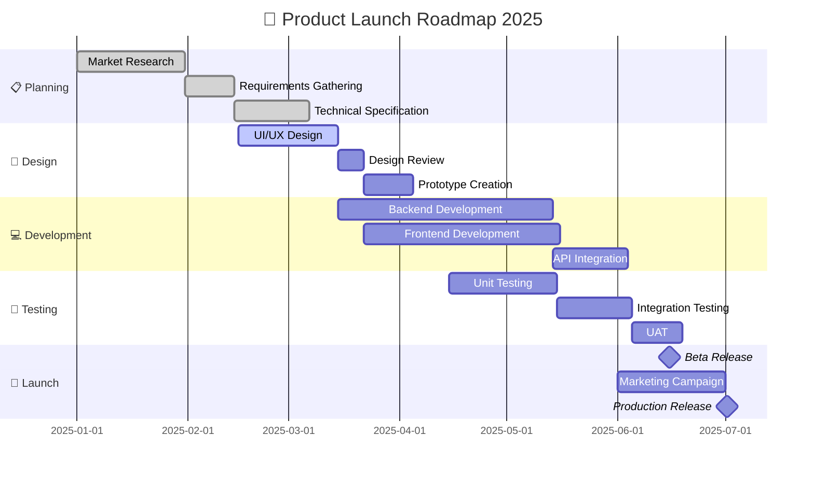

---

## 🥧 Pie Charts

### 📊 Technology Stack Distribution

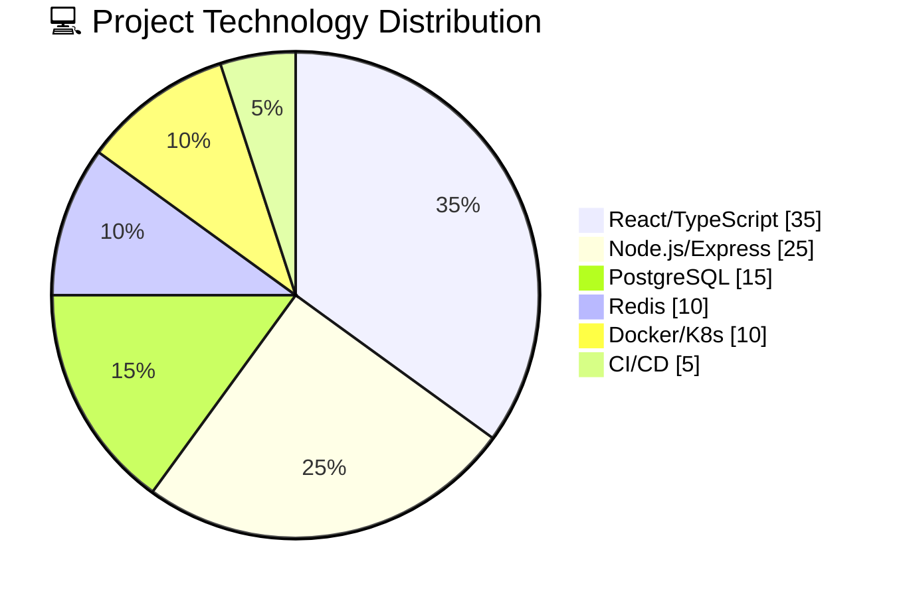

### 📈 Time Allocation

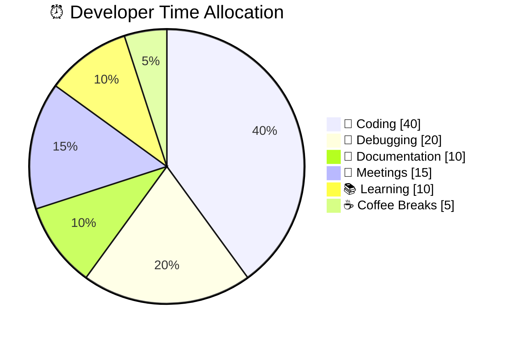

---

## 🧠 Mind Maps

### 🎯 Project Planning

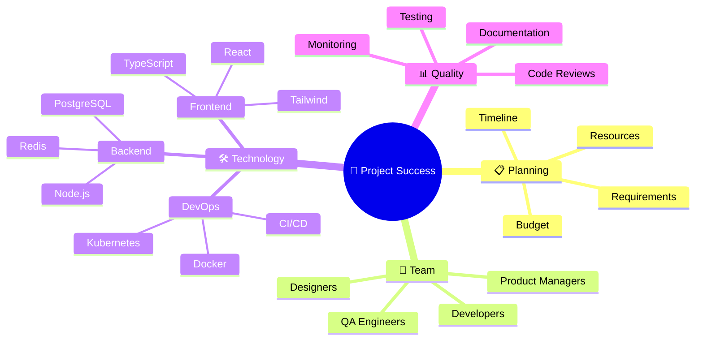

---

## 🎭 Git Graph

### 📌 Branch Strategy Visualization

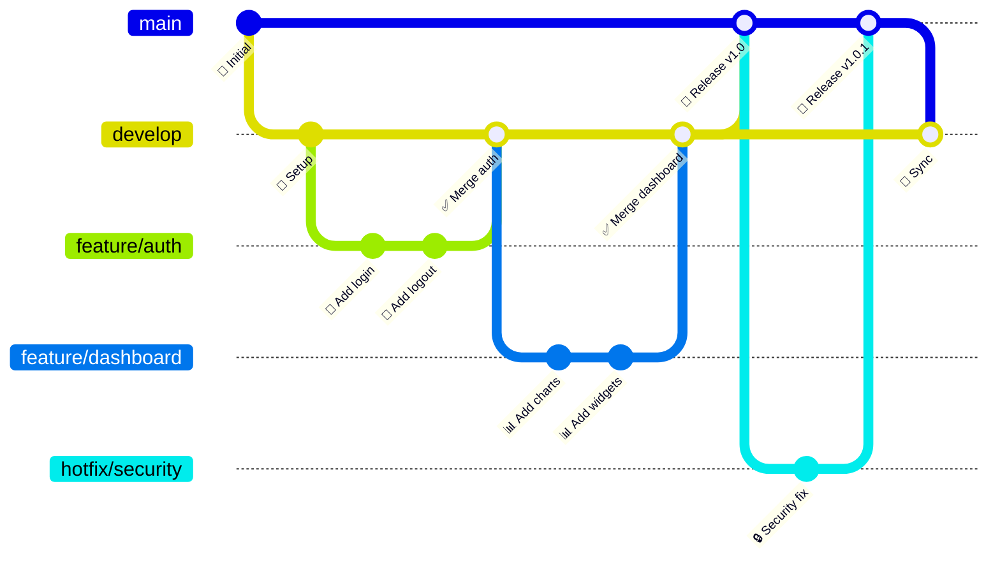

---

## 💻 Code Snippets

### 🔷 TypeScript - React Hook

```typescript
import { useState, useEffect, useCallback } from 'react';

interface UseFetchResult<T> {
  data: T | null;
  loading: boolean;
  error: Error | null;
  refetch: () => void;
}

/**
 * 🎣 Custom hook for data fetching with loading and error states
 * @param url - The URL to fetch data from
 * @returns Object containing data, loading state, error, and refetch function
 */
export function useFetch<T>(url: string): UseFetchResult<T> {
  const [data, setData] = useState<T | null>(null);
  const [loading, setLoading] = useState<boolean>(true);
  const [error, setError] = useState<Error | null>(null);

  const fetchData = useCallback(async () => {
    try {
      setLoading(true);
      setError(null);

      const response = await fetch(url);

      if (!response.ok) {
        throw new Error(`HTTP error! status: ${response.status}`);
      }

      const result = await response.json();
      setData(result);
    } catch (e) {
      setError(e instanceof Error ? e : new Error('Unknown error'));
    } finally {
      setLoading(false);
    }
  }, [url]);

  useEffect(() => {
    fetchData();
  }, [fetchData]);

  return { data, loading, error, refetch: fetchData };
}
```

### 🐍 Python - Async Data Processing

```python
import asyncio
from typing import List, Dict, Any
from dataclasses import dataclass
from datetime import datetime

@dataclass
class ProcessingResult:
    """📦 Result of data processing operation"""
    success: bool
    data: Dict[str, Any]
    timestamp: datetime
    processing_time_ms: float

async def process_batch(items: List[Dict]) -> List[ProcessingResult]:
    """
    🚀 Process a batch of items concurrently

    Args:
        items: List of items to process

    Returns:
        List of ProcessingResult objects
    """
    async def process_single(item: Dict) -> ProcessingResult:
        start = datetime.now()

        # Simulate async processing
        await asyncio.sleep(0.1)

        processed_data = {
            "id": item.get("id"),
            "status": "✅ completed",
            "transformed": {k: v.upper() if isinstance(v, str) else v
                          for k, v in item.items()}
        }

        elapsed = (datetime.now() - start).total_seconds() * 1000

        return ProcessingResult(
            success=True,
            data=processed_data,
            timestamp=datetime.now(),
            processing_time_ms=elapsed
        )

    # 🎯 Process all items concurrently
    tasks = [process_single(item) for item in items]
    results = await asyncio.gather(*tasks, return_exceptions=True)

    return [r for r in results if isinstance(r, ProcessingResult)]

# 🏃 Run the async processing
if __name__ == "__main__":
    sample_data = [
        {"id": 1, "name": "Alpha", "value": 100},
        {"id": 2, "name": "Beta", "value": 200},
        {"id": 3, "name": "Gamma", "value": 300},
    ]

    results = asyncio.run(process_batch(sample_data))
    print(f"✨ Processed {len(results)} items successfully!")
```

### 🗄️ SQL - Analytics Query

```sql
-- 📊 Monthly Sales Analytics Dashboard Query
WITH monthly_sales AS (
    SELECT
        DATE_TRUNC('month', order_date) AS month,
        category_name,
        SUM(quantity * unit_price) AS total_sales,
        COUNT(DISTINCT order_id) AS order_count,
        COUNT(DISTINCT customer_id) AS unique_customers
    FROM orders o
    JOIN order_items oi ON o.order_id = oi.order_id
    JOIN products p ON oi.product_id = p.product_id
    JOIN categories c ON p.category_id = c.category_id
    WHERE order_date >= DATE_TRUNC('year', CURRENT_DATE)
    GROUP BY 1, 2
),
growth_metrics AS (
    SELECT
        month,
        category_name,
        total_sales,
        order_count,
        unique_customers,
        -- 📈 Calculate month-over-month growth
        LAG(total_sales) OVER (
            PARTITION BY category_name
            ORDER BY month
        ) AS prev_month_sales,
        ROUND(
            (total_sales - LAG(total_sales) OVER (
                PARTITION BY category_name ORDER BY month
            )) / NULLIF(LAG(total_sales) OVER (
                PARTITION BY category_name ORDER BY month
            ), 0) * 100, 2
        ) AS growth_percentage
    FROM monthly_sales
)
SELECT
    TO_CHAR(month, 'YYYY-MM') AS "📅 Month",
    category_name AS "📦 Category",
    '$' || TO_CHAR(total_sales, 'FM999,999,999.00') AS "💰 Sales",
    order_count AS "🛒 Orders",
    unique_customers AS "👥 Customers",
    COALESCE(growth_percentage || '%', 'N/A') AS "📈 Growth"
FROM growth_metrics
ORDER BY month DESC, total_sales DESC;
```

---

## ⚠️ Admonitions

:::tip 💡 Pro Tip
Mermaid diagrams are rendered client-side, so they're fully interactive! Try hovering over elements in the diagrams above.
:::

:::info ℹ️ Did You Know?
Mermaid supports over 15 different diagram types, including flowcharts, sequence diagrams, class diagrams, state diagrams, ER diagrams, and more!
:::

:::warning ⚠️ Important
When using Mermaid in Docusaurus, make sure you have `@docusaurus/theme-mermaid` installed and configured in your `docusaurus.config.js`.
:::

:::danger 🚨 Critical
Never commit sensitive information in diagram code! Diagrams are rendered as SVG and can be inspected in the browser.
:::

:::note 📝 Note
All diagrams on this page are live-rendered using Mermaid.js v10+. They will adapt to your color theme automatically!
:::

---

## 🎨 Quick Reference Card

| Diagram Type | Best Used For | Complexity |
|:------------:|:--------------|:----------:|
| 📊 Flowchart | Process flows, decisions | ⭐⭐ |
| 🔄 Sequence | API calls, interactions | ⭐⭐⭐ |
| 🏗️ Class | OOP design, relationships | ⭐⭐⭐⭐ |
| 🔀 State | Lifecycles, status changes | ⭐⭐⭐ |
| 🗺️ ER | Database design | ⭐⭐⭐⭐ |
| 📅 Gantt | Project timelines | ⭐⭐ |
| 🥧 Pie | Data distribution | ⭐ |
| 🧠 Mind Map | Brainstorming, concepts | ⭐⭐ |
| 📌 Git Graph | Branch strategies | ⭐⭐⭐ |

---

## 🔗 Useful Links

- 📚 [Mermaid Official Documentation](https://mermaid.js.org/)
- 🎨 [Mermaid Live Editor](https://mermaid.live/)
- 📖 [Docusaurus Mermaid Theme](https://docusaurus.io/docs/markdown-features/diagrams)

---

<div align="center">

### 🌟 Happy Diagramming! 🌟

*Made with ❤️ using Docusaurus & Mermaid*

</div>
