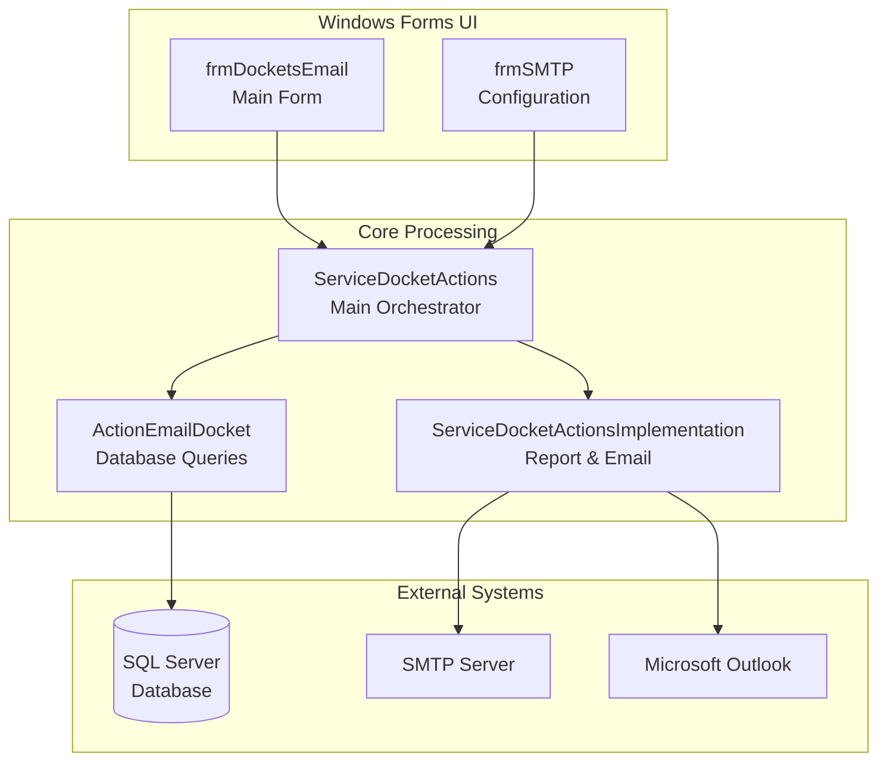
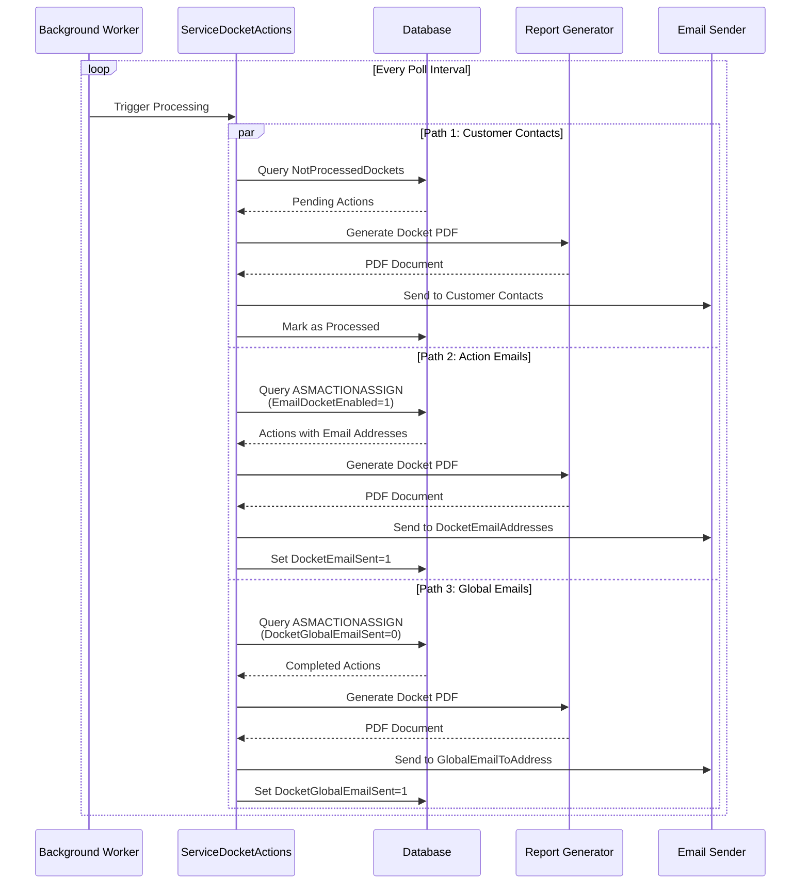

# ABM Service Docket Email Processor

A Windows Forms service application that automatically emails and prints job card dockets for completed service actions. It monitors the ABM Service database and processes dockets based on customer contact preferences and global email configurations.

## Overview

The EmailPrintABMService (output: `ASMDocketEmailPrint.exe`) runs as a background service, polling the database at configurable intervals to detect completed service actions that require email notifications. The system supports three independent email processing paths, allowing flexible configuration for different business needs.

### Key Features

- **Automatic Email Processing** - Monitors database for completed actions and sends emails automatically
- **Three Independent Email Paths** - Customer preferences, action-specific, and global monitoring
- **PDF Docket Generation** - Creates professional job card dockets using DevExpress XtraReports
- **Attachment Processing** - Includes PDF and image attachments from service actions
- **Dual Sending Methods** - Supports both SMTP and Outlook interop for email delivery
- **Configurable Polling** - Adjustable poll intervals from 3 seconds to 30 minutes
- **Customer Contact Integration** - Respects customer-defined email preferences and contacts

## Tech Stack

| Component | Technology |
|-----------|-----------|
| **Framework** | .NET Framework 3.5 (x86) |
| **UI** | DevExpress v12.1 WinForms, XtraBars |
| **Reporting** | DevExpress XtraReports (.repx files) |
| **PDF Processing** | iTextSharp 4.1.6 |
| **Configuration** | Newtonsoft.Json 4.5 |
| **Database** | SQL Server |
| **Email** | SMTP (TLS 1.2) or Outlook Interop |

## Architecture

The application follows a modular architecture with clear separation between database access, report generation, and email delivery.



### Processing Flow



## Running the Application

The application requires command-line arguments to initialize:

```bash
ASMDocketEmailPrint.exe <CompanyId> <DatabaseConnectionString> [<CompanyPath>] [/AUTOSTART]
```

**Arguments:**

| Argument | Required | Description |
|----------|----------|-------------|
| `CompanyId` | Yes | Database company identifier (integer) |
| `DatabaseConnectionString` | Yes | SQL Server connection string |
| `CompanyPath` | No | Path to company-specific resources |
| `/AUTOSTART` | No | Automatically starts email/print processing on launch |

**Example:**
```bash
ASMDocketEmailPrint.exe 1 "Server=localhost;Database=ABMService;Integrated Security=true;" "C:\ABMData\Company1" /AUTOSTART
```

## Quick Links

- [Email Processing Paths](email-processing-paths/overview) - Detailed documentation of the three email paths
