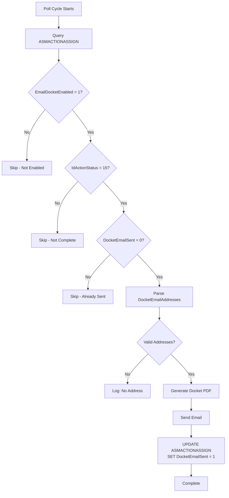
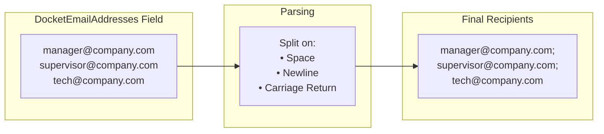

# Path 2: Action-Specific Emails

**Purpose**: Send emails to explicit addresses configured per action

This path allows individual actions to have their own email recipients, independent of customer preferences. Use this when specific actions need to be sent to supervisors, managers, or other recipients.

## Processing Flow



## Data Source

**Table**: `ASMACTIONASSIGN` (direct query)

**Selection Query**:
```sql
SELECT assa.IdAction, assa.DocketEmailAddresses,
       RTRIM(ca.IDNumber) CallNumber, RTRIM(c.CustomerTitle) CustomerTitle
FROM ASMACTIONASSIGN assa
JOIN ASMActions a ON a.UniqueId = assa.IdAction
LEFT JOIN ASMCalls ca ON ca.CallUID = a.CallUID
LEFT JOIN Customers c ON c.UniqueId = ca.CustomerId
WHERE assa.EmailDocketEnabled = 1
  AND assa.IdActionStatus = 15
  AND assa.DocketEmailSent = 0
```

## Key Database Fields

### ASMACTIONASSIGN Table

| Field | Type | Description |
|-------|------|-------------|
| `EmailDocketEnabled` | bit | Must be 1 to enable email for this action |
| `DocketEmailAddresses` | text | Space/newline-separated email addresses |
| `DocketEmailSent` | bit | 0 = pending, 1 = sent |
| `IdActionStatus` | int | Must be 15 (completed status) |
| `IdAction` | int | Foreign key to ASMActions |

## Email Recipients

Recipients come from the `DocketEmailAddresses` field, which supports multiple addresses:



**Parsing Logic**:
- Addresses are split on space, newline, and carriage return characters
- Empty entries are filtered out
- Valid addresses are joined with semicolons for sending

## After Processing

When an action is successfully emailed:

```sql
UPDATE ASMActionAssign
SET DocketEmailSent = 1
WHERE IdAction = @ActionId
```

## Reset Procedure

To re-send emails for Path 2, reset the sent flag:

```sql
UPDATE ASMACTIONASSIGN
SET DocketEmailSent = 0
WHERE IdAction = @ActionId
```

## Configuration Requirements

For an action to be processed by Path 2:

| Requirement | Field | Value |
|-------------|-------|-------|
| Email enabled | `EmailDocketEnabled` | 1 |
| Action complete | `IdActionStatus` | 15 |
| Not yet sent | `DocketEmailSent` | 0 |
| Has addresses | `DocketEmailAddresses` | Not empty |

## Use Cases

- Send completed action to supervisor for review
- Notify project manager when milestone actions complete
- CC specific stakeholders on important service actions
- Send to customer contacts not in the standard customer record
- Override customer preferences for specific high-priority actions
