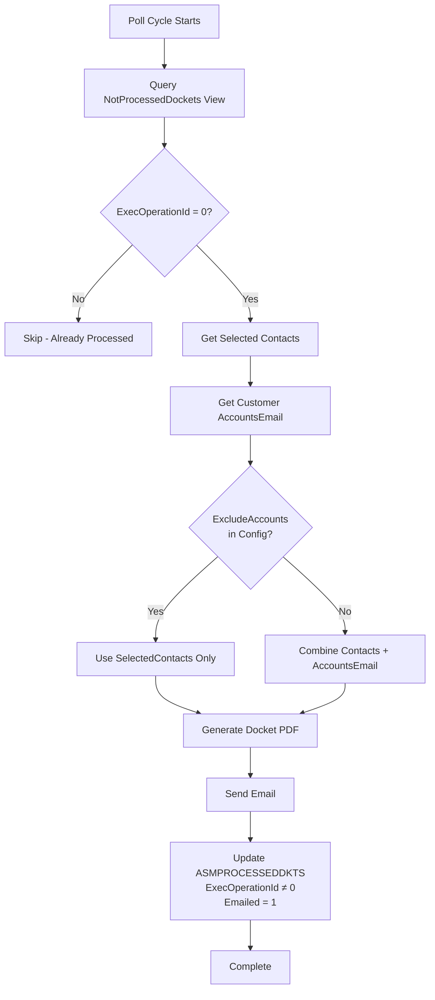
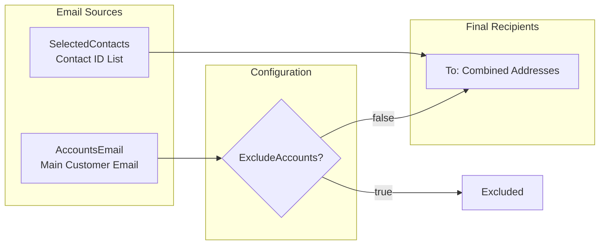

# Path 1: Customer Contacts

**Purpose**: Send emails based on customer preferences and selected contacts

This path processes dockets according to customer-defined email preferences, allowing customers to specify which contacts should receive service docket notifications.

## Processing Flow



## Data Source

**View**: `NotProcessedDockets` → `ASMPROCESSEDDKTS` table

**Selection Query**:
```sql
SELECT pd.IdAction, pd.CustomerId, pd.SelectedContacts, pd.OperationIdToExecute,
       pd.Printed, pd.Emailed, ca.IDNumber, c.CustomerTitle
FROM [NotProcessedDockets] pd
LEFT JOIN Customers c ON c.UniqueId = pd.CustomerId
LEFT JOIN ASMActions a ON a.UniqueId = pd.IdAction
LEFT JOIN ASMCalls ca ON ca.CallUID = a.CallUID
```

**NotProcessedDockets View Filter**:
```sql
FROM ASMPROCESSEDDKTS processed
WHERE (processed.ExecOperationId = 0)
```

## Key Database Fields

### ASMPROCESSEDDKTS Table

| Field | Type | Description |
|-------|------|-------------|
| `ExecOperationId` | int | 0 = pending, non-zero = complete |
| `Emailed` | bit | Tracks if email was sent |
| `Printed` | bit | Tracks if action was printed |
| `IdAction` | int | Foreign key to ASMActions |
| `CustomerId` | int | Foreign key to Customers |

### ASMCustomerExtra Table

| Field | Type | Description |
|-------|------|-------------|
| `SelectedContacts` | string | Semicolon-separated list of contact IDs |
| `DocketOperation` | int | Bitwise flag: 1=Print, 2=Email, 3=Both |

## Email Recipients

Recipients are determined by combining two sources:

1. **Selected Contacts** - From `ASMCustomerExtra.SelectedContacts` (semicolon-separated contact IDs)
2. **Customer Account Email** - From `Customers.AccountsEmail` (unless `ExcludeAccounts=true` in config)



## After Processing

When an action is successfully processed:

```sql
-- Mark as processed (prevents re-processing)
UPDATE ASMPROCESSEDDKTS
SET ExecOperationId = @OperationId,
    Emailed = 1
WHERE IdAction = @ActionId
```

## Example Log Entry

```
Emailing Dnata Catering Ireland LTD - D085129/150189  No Email Address specified
```

## Reset Procedure

To re-send emails for Path 1, reset the following fields in ASMPROCESSEDDKTS:

```sql
UPDATE ASMPROCESSEDDKTS
SET ExecOperationId = 0,
    Emailed = 0
WHERE IdAction = @ActionId
```

## Use Cases

- Customer wants specific contacts notified when service is complete
- Different contacts for different types of service (maintenance vs. repair)
- Centralized customer email preferences management
- Automated notification based on customer account settings
