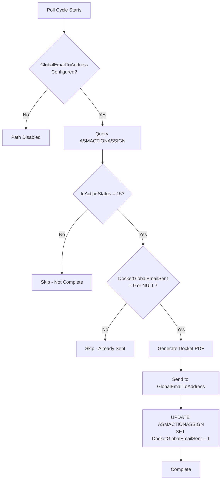
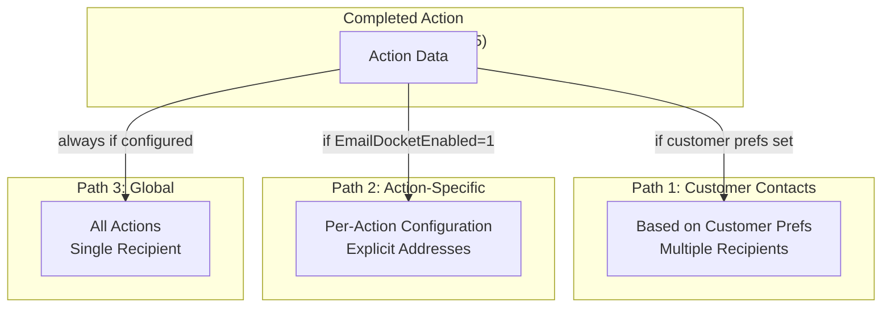

# Path 3: Global Monitoring

**Purpose**: Send all completed actions to a global monitoring email address

This path automatically sends every completed action to a central email address for oversight and monitoring. It operates independently of customer preferences and action-specific settings.

## Processing Flow



## Data Source

**Table**: `ASMACTIONASSIGN` (direct query)

**Selection Query**:
```sql
SELECT assa.IdAction, RTRIM(ca.IDNumber) CallNumber,
       RTRIM(c.CustomerTitle) CustomerTitle
FROM ASMACTIONASSIGN assa
JOIN ASMActions a ON a.UniqueId = assa.IdAction
LEFT JOIN ASMCalls ca ON ca.CallUID = a.CallUID
LEFT JOIN Customers c ON c.UniqueId = ca.CustomerId
WHERE assa.IdActionStatus = 15
  AND (assa.DocketGlobalEmailSent IS NULL OR assa.DocketGlobalEmailSent = 0)
```

## Key Database Fields

### ASMACTIONASSIGN Table

| Field | Type | Description |
|-------|------|-------------|
| `DocketGlobalEmailSent` | bit | NULL/0 = pending, 1 = sent |
| `IdActionStatus` | int | Must be 15 (completed status) |
| `IdAction` | int | Foreign key to ASMActions |

## Configuration

The global email address is configured in `Configuration.json`:

```json
{
  "GlobalEmailToAddress": "manager@company.com",
  "SMTPConfiguration": {
    "SmtpPortNumber": 587,
    "SmtpHost": "smtp.gmail.com",
    "EmailAddress": "sender@example.com",
    "EmailPassword": "password",
    "EmailDisplayName": "Display Name"
  }
}
```

| Setting | Description |
|---------|-------------|
| `GlobalEmailToAddress` | The single email address that receives all completed action dockets |

```mermaid
flowchart LR
    subgraph Config["Configuration.json"]
        ADDR["GlobalEmailToAddress:<br/>manager@company.com"]
    end

    subgraph Actions["All Completed Actions"]
        A1[Action 1]
        A2[Action 2]
        A3[Action 3]
        AN[Action N...]
    end

    subgraph Recipient["Single Recipient"]
        GLOBAL[manager@company.com]
    end

    A1 --> GLOBAL
    A2 --> GLOBAL
    A3 --> GLOBAL
    AN --> GLOBAL
    ADDR -.->|configures| GLOBAL
```

## After Processing

When an action is successfully emailed:

```sql
UPDATE ASMActionAssign
SET DocketGlobalEmailSent = 1
WHERE IdAction = @ActionId
```

## Reset Procedure

To re-send global emails for Path 3:

```sql
UPDATE ASMACTIONASSIGN
SET DocketGlobalEmailSent = 0
WHERE IdAction = @ActionId
```

## Enabling/Disabling Path 3

| To Enable | To Disable |
|-----------|------------|
| Set `GlobalEmailToAddress` to a valid email address | Remove or leave `GlobalEmailToAddress` empty |

## Comparison with Other Paths



## Use Cases

- **Management Oversight** - All completed work automatically sent to management
- **Quality Control** - Central review of all service dockets
- **Audit Trail** - Email archive of all completed actions
- **Backup Notification** - Ensures at least one copy of every docket is emailed
- **Compliance** - Regulatory requirements for notification of completed services
