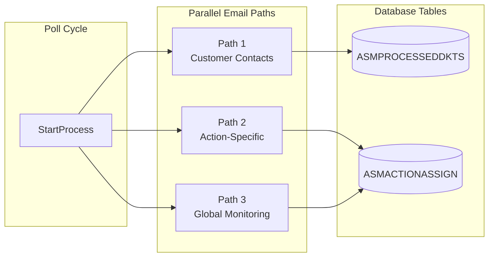
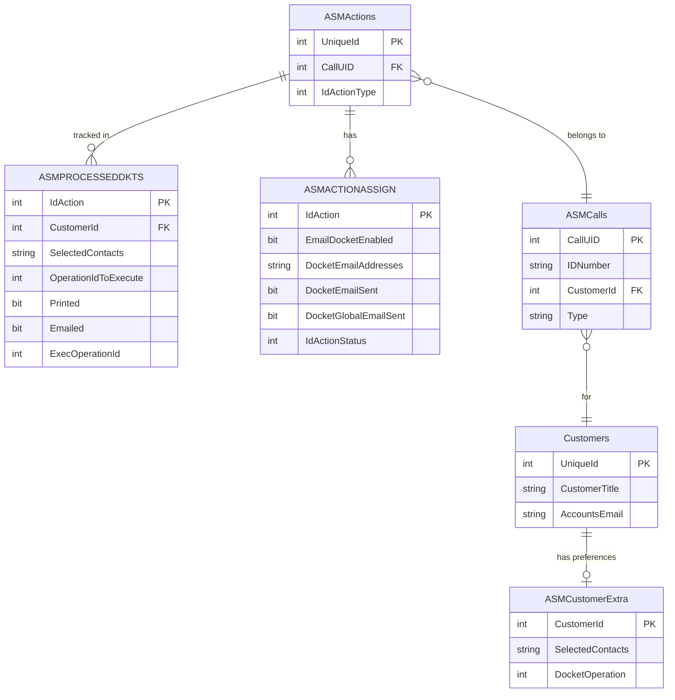

# Email Processing

The EmailPrintABMService application processes completed actions through **three independent email routines** that run in parallel during each poll cycle. Each routine serves a different purpose and uses different database fields.

## Architecture Overview

The main processing method calls all three routines simultaneously:

```csharp
private static void StartProcess(ILog log)
{
    SendCustomerContactsEmails(log);   // Path 1: Customer Preferences
    SendActionsEmails(log);             // Path 2: Action-Specific Emails
    SendGlobalActionsEmails(log);       // Path 3: Global Monitoring
}
```



## Comparison Matrix

| Feature | Path 1: Customer Contacts | Path 2: Action-Specific | Path 3: Global Monitoring |
|---------|--------------------------|-------------------------|---------------------------|
| **Table** | ASMPROCESSEDDKTS | ASMACTIONASSIGN | ASMACTIONASSIGN |
| **View** | NotProcessedDockets | Direct query | Direct query |
| **Enable Flag** | ExecOperationId=0 | EmailDocketEnabled=1 | GlobalEmailToAddress configured |
| **Email Source** | SelectedContacts + AccountsEmail | DocketEmailAddresses | Configuration.json |
| **Sent Flag** | Emailed=1, ExecOperationId≠0 | DocketEmailSent=1 | DocketGlobalEmailSent=1 |
| **Use Case** | Customer preferences | Explicit per-action emails | Central monitoring |

## Database Relationships



## Important Notes

1. **Independence**: All three paths are independent - an action can be processed by one, two, or all three paths depending on configuration

2. **Different Tables**: Path 1 uses ASMPROCESSEDDKTS, Paths 2 & 3 use ASMACTIONASSIGN directly

3. **Different Reset Procedures**:
   - Path 1: Reset `ExecOperationId=0` and `Emailed=0` in ASMPROCESSEDDKTS
   - Path 2: Reset `DocketEmailSent=0` in ASMACTIONASSIGN
   - Path 3: Reset `DocketGlobalEmailSent=0` in ASMACTIONASSIGN

4. **Status 15**: All paths require `IdActionStatus=15` (completed) to process actions

5. **No Cross-Contamination**: The paths don't interfere with each other - resetting one doesn't affect the others

## Quick Links

- [Path 1: Customer Contacts](customer-contacts) - Send based on customer preferences
- [Path 2: Action-Specific](action-specific) - Send to explicit addresses per action
- [Path 3: Global Monitoring](global-monitoring) - Send all to central address
