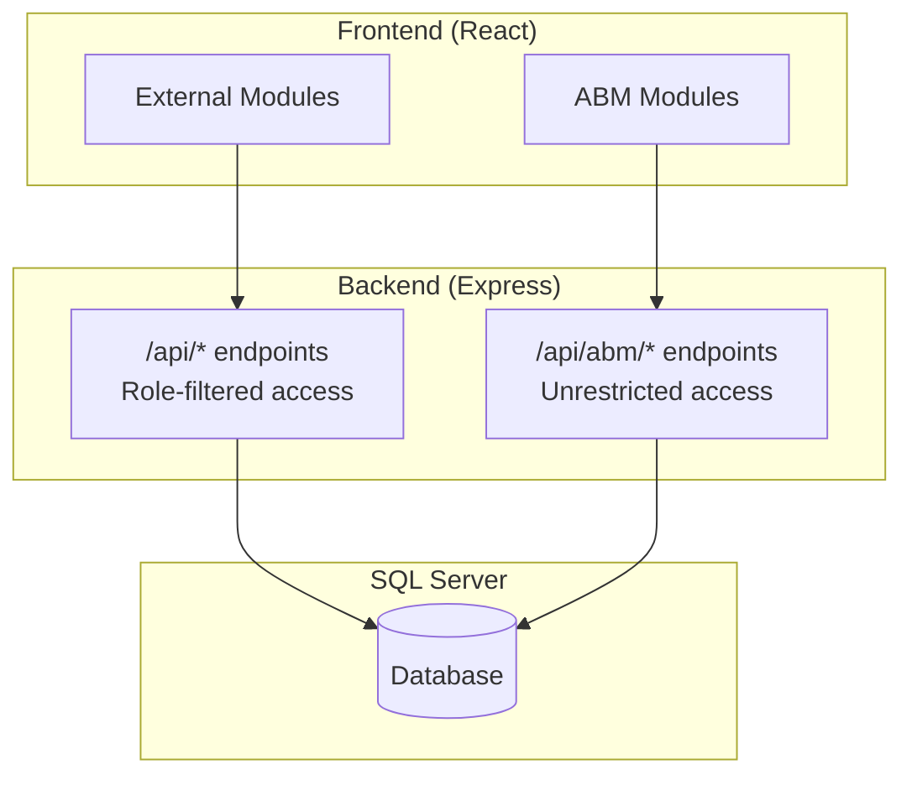

# ABM Web Portal

A full-stack service management application for tracking service calls, customers, actions, timesheets, and related business operations.

## Overview

The ABM Service Web Portal provides a comprehensive platform for managing field service operations. The system serves two distinct user types with different access levels and capabilities.

### User Types

| User Type | Description | Access Level |
|-----------|-------------|--------------|
| **External Users** | Customers and partners accessing the portal | Role-based filtered access to their own data |
| **ABM (Internal) Users** | Internal staff and administrators | Full unrestricted access to all data |

### Key Features

- **Service Call Management** - Track and manage service requests from creation to completion
- **Customer Management** - Maintain customer records, contacts, and service history
- **Action Tracking** - Log and monitor actions taken on service calls
- **Timesheet Management** - Track employee time and job assignments
- **Job Management** - Organize and schedule work orders
- **Payment Processing** - Accept payments via Stripe integration
- **Reporting** - Generate reports on service operations and metrics

## Tech Stack

| Layer | Technologies |
|-------|-------------|
| **Frontend** | React 18, Redux Toolkit, Material-UI v5, TailwindCSS, DevExtreme data grids |
| **Backend** | Node.js, Express, JWT authentication |
| **Database** | Microsoft SQL Server |
| **Deployment** | Docker with Tailscale VPN for secure database connectivity |

## Architecture

The application follows a dual API architecture to support different user access patterns:

### Dual API System

The server exposes parallel API systems for the same features with different access patterns:

| API | Path Pattern | Access Pattern |
|-----|--------------|----------------|
| External | `/api/customers`, `/api/calls`, etc. | Role-filtered queries with permission checks |
| ABM | `/api/abm/customers`, `/api/abm/calls`, etc. | Unrestricted data access for internal users |

### Authentication

- JWT token-based authentication
- Role-based access control with roles including: `admin`, `external`, `abmuser`, `timesheetuser`, `jobmanager`
- User permissions configured per-user for granular access control
- Protected routes enforce authentication on both server and client

## Quick Links

- [Installation Prerequisites](installation/prerequisites)
- [Stripe Integration](stripe-integration/)
