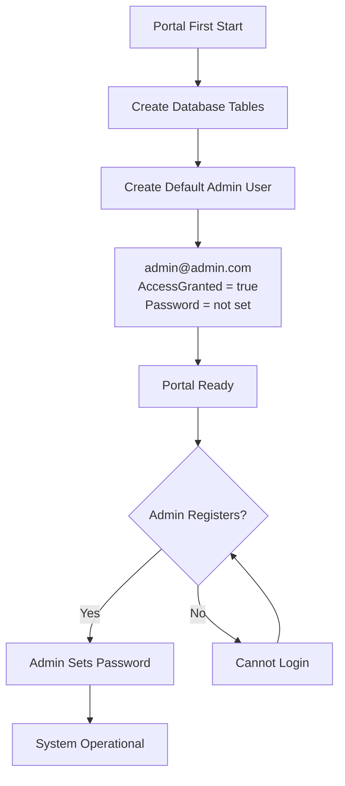
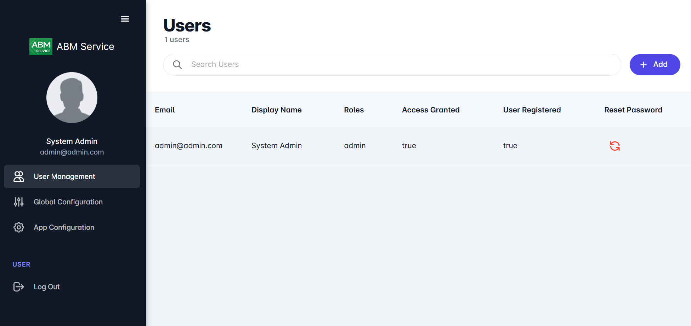
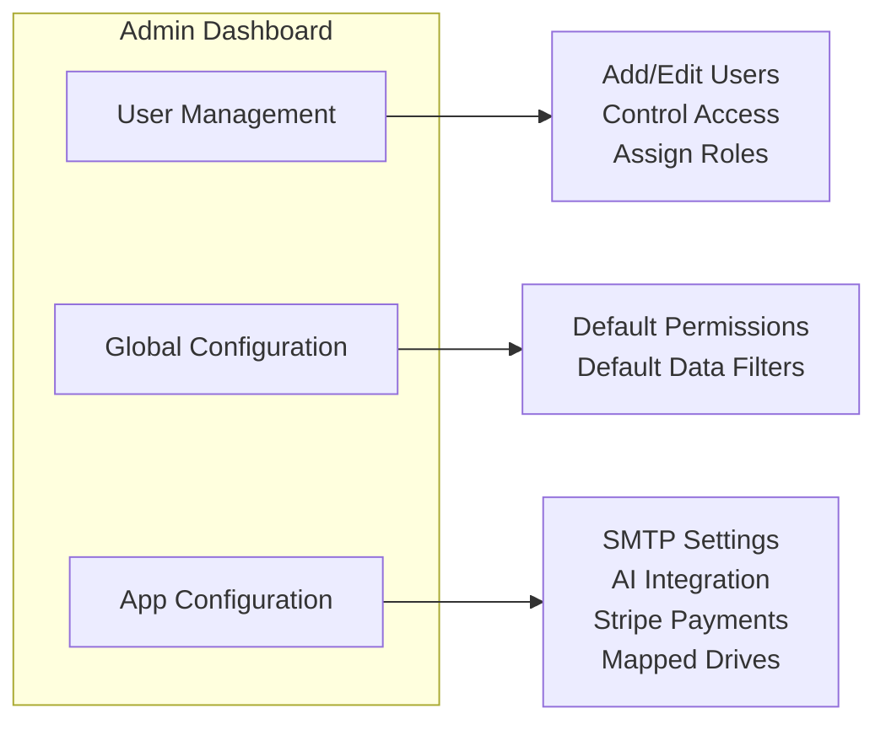
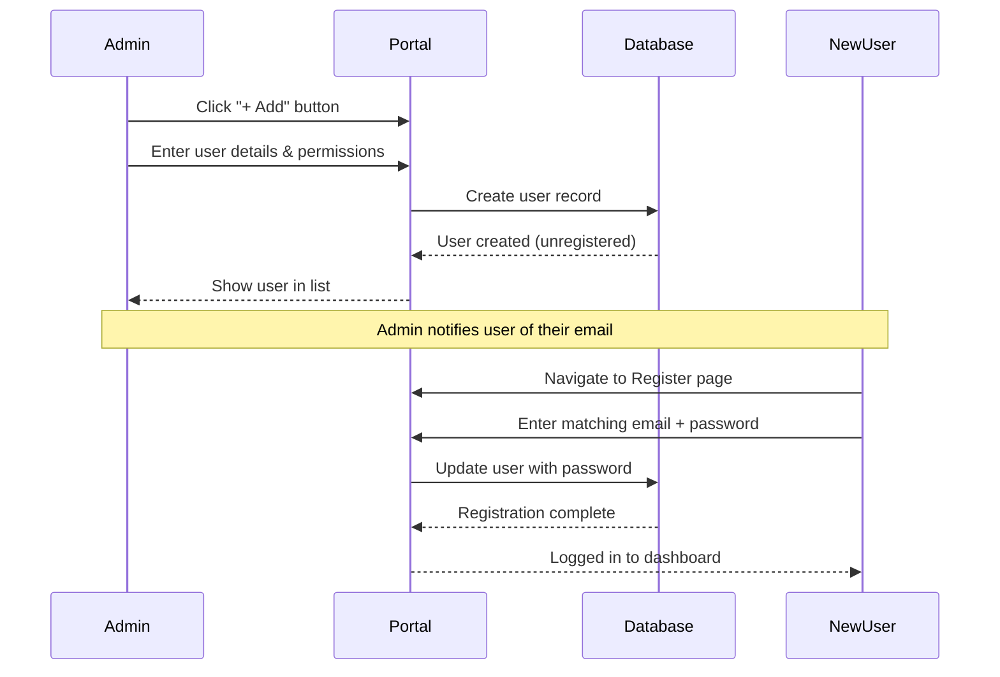
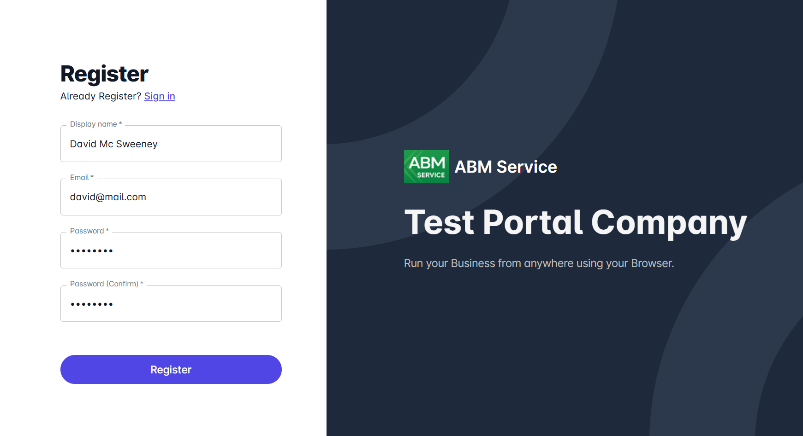
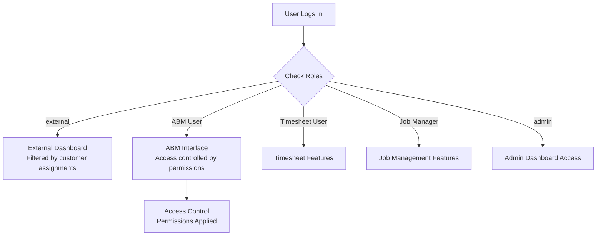

# Initial Setup Guide

This guide walks you through the first steps to configure the ABM Service Web Portal after installation. You will set up the admin account, create users, and understand the configuration options available.

## Prerequisites

Before you begin, ensure you have:

- Completed the [ABM Web Portal Installation](/abm-web-portal/installation/quick-start)
- Access to the web portal URL where the application is hosted
- The portal server is running and accessible

## First Startup Process

When the portal starts for the first time, it automatically initializes the system:

:::important
The default admin user has `AccessGranted=true` but no password set. You must register this account to set a password before you can use the portal.
:::

## Step 1: Register the Admin User

The first step after installation is to register the default admin account by setting its password.

**1.** Navigate to your portal URL in a web browser.

**2.** On the Sign In page, click the **"Register"** link below the sign in form.

**3.** Fill in the registration form:

| Field | Value |
|-------|-------|
| **Display name** | `System Admin` (or your preferred name) |
| **Email** | `admin@admin.com` |
| **Password** | Enter a secure password |
| **Password (Confirm)** | Re-enter the same password |

**4.** Click the **"Register"** button.

**5.** You will be logged in automatically and taken to the admin dashboard.

:::note
The email address must match exactly `admin@admin.com` as this is the pre-created admin account. Using a different email will fail since no other users exist yet.
:::

## Step 2: Admin Dashboard Overview

After registration, you will see the admin dashboard. This is your central hub for managing the portal.

### Dashboard Sections

The admin dashboard provides access to three main areas:

| Section | Description |
|---------|-------------|
| **User Management** | Add, edit, and manage portal users. Control who can access the system and what they can do. |
| **Global Configuration** | Set system-wide defaults for access control permissions and data filters that apply to new users. |
| **App Configuration** | Configure optional integrations like SMTP (email), AI features, Stripe (payments), and mapped drives. |

## Step 3: Creating a New User

Before someone can use the portal, an admin must create their user account first. Users then register with the email address you specify.

### User Creation Flow

### Steps

**1.** On the Users page, click the **"+ Add"** button in the top-right corner.

**2.** A new user form appears. Fill in the required fields:

### User Details

| Field | Required | Description |
|-------|----------|-------------|
| **Email** | Yes | The email address the user will register with |
| **Display Name** | Yes | The user's name shown in the portal |
| **Access Granted** | - | Check this box to allow the user to register and log in |

### User Roles

Select one or more roles for the user:

| Role | Description |
|------|-------------|
| `external` | External user with filtered access based on customer assignments |
| `ABM User` | Internal ABM staff with full unrestricted access |
| `Timesheet User` | Access to timesheet tracking features |
| `Job Manager` | Access to job management features |
| `admin` | System administrator with access to admin dashboard |

:::warning
If you assign the **ABM User** role, you must also select which ABM user to link from the dropdown list. This connects the portal user to their ABM database record.
:::

### User Access Control

The lower section contains permission settings that control what data and actions the user can access.

You have two options:

1. **Configure manually** - Set each permission individually
2. **Copy from Defaults** - Click this button to copy the default permissions from Global Configuration

:::tip
Use "Copy from Defaults" for most users, then adjust individual settings as needed.
:::

**3.** Click **"Save"** to create the user.

**4.** The user now appears in the list with **User Registered = false**, indicating they have not yet registered.

## Step 4: New User Registration

After an admin creates a user account, that person can register to set their password and start using the portal.

### Steps (for the new user)

**1.** Navigate to the portal URL in a web browser.

**2.** On the Sign In page, click the **"Register"** link.

**3.** Fill in the registration form:

| Field | Value |
|-------|-------|
| **Display name** | Your name |
| **Email** | The email address the admin used when creating your account |
| **Password** | Choose a secure password |
| **Password (Confirm)** | Re-enter the same password |

:::important
The email address must match exactly what the admin entered. If it doesn't match, registration will fail.
:::

**4.** Click the **"Register"** button.

**5.** You will be logged in automatically and see the dashboard appropriate for your assigned roles.

### Role-Based Access

The user will see different features based on their assigned roles and access control permissions:

## Next Steps

After completing the initial user setup, you may want to configure additional portal features.

### App Configuration

Navigate to **App Configuration** in the admin dashboard to set up optional integrations:

| Feature | Description |
|---------|-------------|
| **SMTP** | Configure email server settings to enable notification emails |
| **AI** | Set up OpenAI or OpenRouter integration for AI-powered features |
| **Stripe** | Configure payment processing for customer payments (see [Stripe Configuration Guide](/abm-web-portal/stripe-integration/configuration)) |
| **Mapped Drives** | Configure network paths for attachment file storage |

### Global Configuration

Navigate to **Global Configuration** to set system-wide defaults:

| Setting | Description |
|---------|-------------|
| **Default Data Filters** | Set default filter values applied to new users |
| **Default Access Control** | Configure default permissions used by the "Copy from Defaults" button when creating users |

These defaults streamline user creation - set them once, and new users automatically inherit sensible starting permissions.

## Troubleshooting

### "User not found" when registering

- Ensure the email address matches exactly what the admin entered (case sensitivity depends on database collation)
- Verify the admin has created the user account first

### "Access not granted" when signing in

- The admin needs to check the **Access Granted** checkbox on the user's profile
- The user may need to wait for admin approval before logging in

### Cannot see expected features after login

- Check the user's assigned roles in the admin dashboard
- For ABM Users, verify the linked ABM User is correctly selected
- Review the User Access Control permissions
