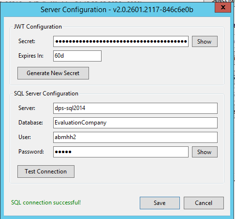

# Configuration Guide

The Configuration Form provides a user-friendly interface for editing the portal's `serverConfig.json` settings.

## Opening the Configuration Form

Click **Edit Configuration** on the main dashboard to open the form.


:::warning
If the service is running, you'll see a warning. It's recommended to stop the service before editing configuration to ensure changes take effect properly.
:::

## JWT Secret

The JWT (JSON Web Token) secret is used to sign authentication tokens for user sessions.

| Field | Description |
|-------|-------------|
| **Secret** | The secret key used to sign tokens (hidden by default) |
| **Expires In** | Token expiration time (default: `60d` for 60 days) |

### Buttons

- **Generate** - Creates a new cryptographically secure random secret
- **Show/Hide** - Toggles visibility of the secret field

:::caution Session Warning
Generating a new JWT secret will **invalidate all existing user sessions**. All logged-in users will be logged out and need to sign in again.
:::

## SQL Server Settings

Configure the database connection for the portal.

| Field | Description |
|-------|-------------|
| **Server** | SQL Server hostname or IP (can include port: `server,1433`) |
| **Database** | Name of the database |
| **User** | SQL Server login username |
| **Password** | SQL Server login password (hidden by default) |

### Test Connection

Click **Test Connection** to verify your SQL Server settings before saving.



- **Green message** = Connection successful
- **Red message** = Connection failed (check your settings)

Common connection issues:
- Incorrect server hostname or IP
- Database doesn't exist
- Invalid username/password
- SQL Server doesn't allow remote connections
- Firewall blocking port 1433

## Saving Configuration

1. Make your changes
2. Click **Save**
3. If validation issues are found, you'll see a warning with details
4. **Restart the service** for changes to take effect

## Configuration File Location

The configuration is stored at:
```
C:\ABMWebPortal-{port}\server\serverConfig.json
```

A backup is automatically created at `serverConfig.json.backup` during upgrades.
