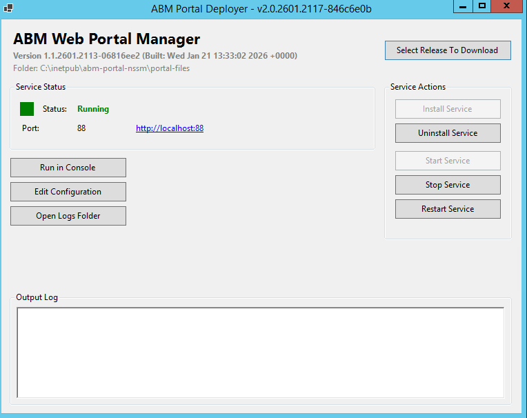

# Deployer Overview

The ABM Portal Deployer is a Windows desktop application that automates the deployment and management of the ABM Service Web Portal on Windows servers.

## Key Features

- **Automatic Updates** - The deployer checks for updates on startup and can update itself automatically
- **Simplified Configuration** - User-friendly form with dedicated fields for JWT and SQL settings
- **Service Management** - Install, start, stop, restart, and uninstall the portal as a Windows service
- **One-Click Upgrades** - Download new portal versions while preserving your configuration
- **Connection Testing** - Validate SQL Server connectivity before deploying

## System Requirements

| Requirement | Minimum |
|-------------|---------|
| Operating System | Windows Server 2016 or later (64-bit) |
| RAM | 4 GB |
| Disk Space | 500 MB |
| .NET Runtime | Included in the tool |
| Network | Internet access for downloading releases |

### Required Information

Before installing, gather the following:

**Database Settings (Required):**
- SQL Server hostname or IP address
- Database name
- SQL username and password

**Portal Settings:**
- Port number (default: 3001)

## Password

The application is password-protected to prevent accidental changes.

**Password:** `direct05`

You will be prompted for this password when:
- Launching the application for the first time (no bundle installed)
- Downloading new releases

## Main Dashboard

The main dashboard provides:
- Service status indicator (colored panel)
- Current version and port information
- Service control buttons (Install, Start, Stop, etc.)
- Configuration and log access
- Portal URL link when running
