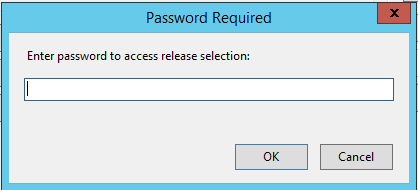
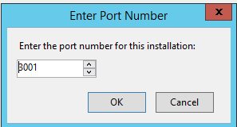

# Quick Start Guide

<video controls width="100%">
  <source src={require('./screenshots/quick-start-video.mp4').default} type="video/mp4" />
</video>

This guide walks you through installing the ABM Service Web Portal for the first time.

## Download the Deployer

Download the latest `ABMPortalDeployer.exe` from:
- **[Google Drive](https://drive.google.com/file/d/1JPCLBzqXd_tdydKYWAiiCrlmuCG7ptGL/view?usp=sharing)**

## Step 1: Launch the Deployer

1. Copy `ABMPortalDeployer.exe` to a dedicated folder (e.g., `C:\ABMPortal`)
2. **Right-click** the exe and select **Run as administrator**
3. If Windows shows a security prompt, click **Yes**

:::note
The portal files will be extracted relative to the exe location. Always run the deployer from the same folder.
:::

## Step 2: Enter the Password

When launching without an existing bundle, you'll see a password dialog.

Enter the password: `direct05`

## Step 3: Download a Release

The Release Selection screen shows available versions.

1. Select a version from the list (latest stable recommended)
2. Review the release notes at the bottom
3. Click **Download** (or double-click the release)
4. Wait for the download and extraction to complete

:::tip
The currently installed version is highlighted in green.
:::

## Step 4: Configure the Portal

After download, the Configuration Form opens automatically if settings need to be configured.

1. Generate a JWT secret (click **Generate**)
2. Enter your SQL Server connection details
3. Click **Test Connection** to verify
4. Click **Save**

See [Configuration Guide](configuration.md) for details on each setting.

## Step 5: Install the Service

1. Click **Install Service** on the main dashboard
2. Enter a port number when prompted (default: 3001)

3. Wait for the installation to complete

## Step 6: Start the Service

1. Click **Start Service**
2. Wait for the status indicator to turn green
3. Click the portal URL link to open in your browser

**Installation complete!** The ABM Portal is now running as a Windows service.

## Quick Reference

| Step | Action |
|------|--------|
| 1 | Run as administrator |
| 2 | Enter password: `direct05` |
| 3 | Download a release |
| 4 | Configure JWT and SQL settings |
| 5 | Install service (choose port) |
| 6 | Start service |
