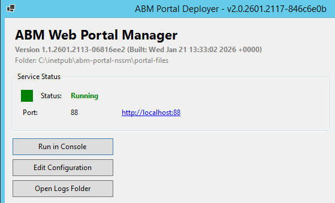

# Service Management

The ABM Portal runs as a Windows service, allowing it to start automatically and run in the background.

## Status Indicator

The colored panel on the main dashboard shows the current service state.

| Color | Status | Description |
|-------|--------|-------------|
| Green | Running | Service is running normally |
| Red | Stopped | Service is not running |
| Orange | Starting/Stopping | Service is transitioning |
| Yellow | Paused | Service is paused |
| Gray | Not Installed | Service hasn't been installed yet |




## Service Operations

### Start Service

Starts a stopped service.

1. Ensure status shows **Stopped** (red)
2. Click **Start Service**
3. Wait for status to change to **Running** (green)
4. Click the portal URL link to verify

### Stop Service

Stops a running service.

1. Click **Stop Service**
2. Wait for status to change to **Stopped** (red)

:::tip
Stop the service before making configuration changes or downloading updates.
:::

### Restart Service

Stops and starts the service in one operation. Use this after making configuration changes.

1. Click **Restart Service**
2. Wait for the service to cycle through stopped and back to running

### Install Service

Creates the Windows service (first time only, or after uninstalling).

1. Click **Install Service**
2. Enter a port number when prompted (default: 3001)
3. The service will be created but not started

:::note
If a port was previously configured in `port.txt`, it will be reused automatically without prompting.
:::

### Uninstall Service

Removes the Windows service from the system.

1. Click **Uninstall Service**
2. Confirm when prompted

:::note
Uninstalling only removes the Windows service registration. Portal files and configuration remain on disk.
:::

## Console Runner

For debugging, you can run the portal in a console window instead of as a background service.

1. Click **Run in Console**
2. A command window opens showing real-time output
3. Watch for error messages
4. Close the window to stop the portal


This is useful when:
- The service won't start and you need to see error messages
- Debugging configuration issues
- Testing changes before committing to service mode

## Logs

Click **Open Logs Folder** to access application logs at:
```
C:\ABMWebPortal-{port}\logs\
```

## Windows Services Manager

The service appears in Windows Services Manager (`services.msc`) as:
```
ABM Web Portal - {port}
```

For example: `ABM Web Portal - 82`


From here you can:
- View the service status and startup type
- Start, stop, pause, or restart the service
- Change the startup type (Automatic, Manual, Disabled)
- View the service description and dependencies

:::tip
You can open Services Manager by pressing `Win + R`, typing `services.msc`, and pressing Enter.
:::
