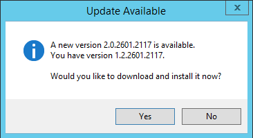
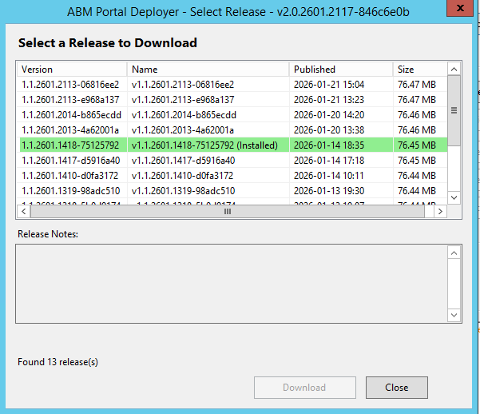

# Upgrades

This guide covers updating both the Deployer application itself and the ABM Portal.

## Deployer Auto-Update

The Deployer checks for updates automatically when launched. If a newer version is available, you'll see a prompt.

Click **Yes** to download and install the update. The application will:
1. Download the new version
2. Close the current instance
3. Replace itself with the new version
4. Restart automatically

:::note
No manual steps required. The update process handles everything automatically.
:::

## Portal Upgrades

To upgrade the ABM Portal to a new version:

### Step 1: Open Release Selection

Click **Select Release To Download** on the main dashboard.

If the service is running, you'll be prompted to stop it first (required to avoid file locking during extraction).

### Step 2: Enter Password

Enter the password: `direct05`

### Step 3: Select New Version

The Release Selection screen shows all available versions.

- Your current version is highlighted in **green** and marked "(Installed)"
- Select a newer version from the list
- Review release notes at the bottom

### Step 4: Download and Install

1. Click **Download**
2. Wait for download and extraction to complete
3. Your configuration is automatically backed up and restored

### Step 5: Start the Service

1. Return to the main dashboard
2. Click **Start Service**
3. Verify the new version number in the title bar

## Configuration Preservation

During upgrades, your configuration is automatically preserved:

1. `serverConfig.json` is backed up before extraction
2. New files are extracted (overwriting old portal files)
3. Configuration is restored from backup
4. Version information is updated

A backup copy is kept at `serverConfig.json.backup` in the server folder.

## Downgrading

You can also downgrade to an older version:

1. Follow the same upgrade steps
2. Select an older version from the release list
3. Your configuration will be preserved

:::caution
Downgrading may cause issues if the older version doesn't support newer configuration options. Test thoroughly after downgrading.
:::

## Upgrade Checklist

| Step | Action |
|------|--------|
| 1 | Note current version |
| 2 | Inform users of brief downtime |
| 3 | Click "Select Release To Download" |
| 4 | Stop service when prompted |
| 5 | Enter password |
| 6 | Select new version and download |
| 7 | Start service |
| 8 | Test portal in browser |
