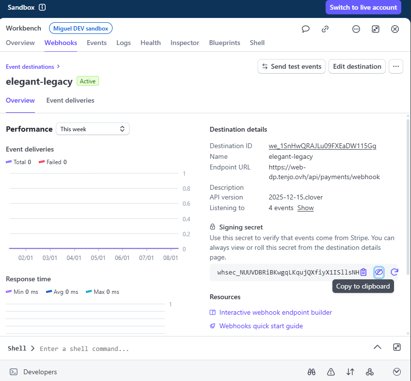
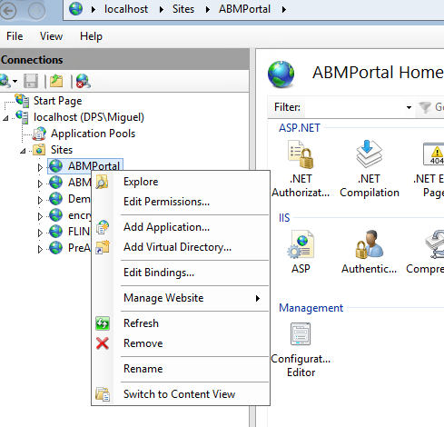
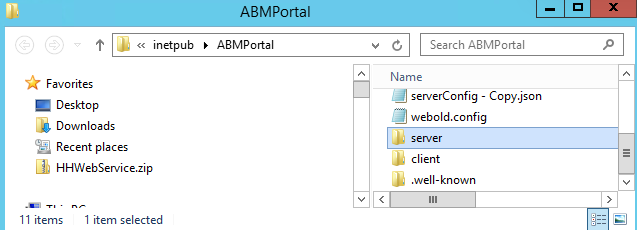
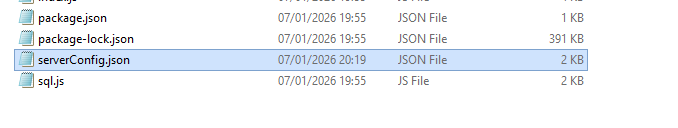
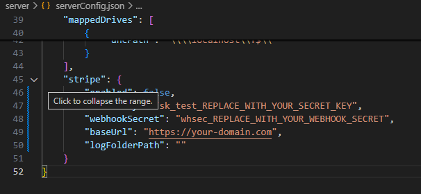

# Stripe Payment Configuration Guide

This guide explains how to configure Stripe payments for the ABM Service Web Portal. It is intended for support staff and administrators who need to set up or troubleshoot payment functionality.

---

## Table of Contents

1. [Overview](#overview)
2. [Prerequisites](#prerequisites)
3. [Configuration Reference](#configuration-reference)
4. [Part 1: Getting the Secret Key](#part-1-getting-the-secret-key)
5. [Part 2: Creating a Webhook Endpoint](#part-2-creating-a-webhook-endpoint)
6. [Part 3: Locating the Configuration File](#part-3-locating-the-configuration-file)
7. [Part 4: Updating the Server Configuration](#part-4-updating-the-server-configuration)
8. [Optional: Enable Automatic Email Receipts](#optional-enable-automatic-email-receipts)
9. [Live Mode Setup](#live-mode-setup)
10. [Testing Your Configuration](#testing-your-configuration)
11. [Troubleshooting](#troubleshooting)

---

## Overview

Stripe is a payment processing service that allows customers to pay invoices securely online. When properly configured, the ABM Service Portal can:

- Generate secure payment links for customers
- Process credit/debit card payments
- Receive real-time payment status updates via webhooks
- Track payment history and receipts

This guide covers the **Sandbox (test) mode** setup. Sandbox mode allows you to test payments without processing real money.

---

## Prerequisites

Before you begin, ensure you have:

- Access to a Stripe account (https://dashboard.stripe.com)
- Administrator access to the server where ABM Service Portal is installed
- The public URL where the portal is hosted (e.g., `https://abm-portal.yourcompany.com`)

---

## Configuration Reference

The Stripe configuration is stored in the server's `serverConfig.json` file under the `stripe` section:

```json
"stripe": {
    "enabled": false,
    "secretKey": "sk_test_REPLACE_WITH_YOUR_SECRET_KEY",
    "webhookSecret": "whsec_REPLACE_WITH_YOUR_WEBHOOK_SECRET",
    "baseUrl": "https://your-domain.com",
    "logFolderPath": ""
}
```

### Field Descriptions

| Field | Description | Required |
|-------|-------------|----------|
| `enabled` | Set to `true` to enable payments, `false` to disable | Yes |
| `secretKey` | Your Stripe API secret key (starts with `sk_test_` or `sk_live_`) | Yes |
| `webhookSecret` | Your webhook signing secret (starts with `whsec_`) | Yes |
| `baseUrl` | Your portal's public URL (see below) | Yes |
| `logFolderPath` | Folder path for payment logs (optional) | No |

### Understanding `baseUrl`

The `baseUrl` is the public web address where your ABM Service Portal is accessible from the internet.

**Why is it needed?** When a customer completes or cancels a payment on Stripe's checkout page, Stripe needs to redirect them back to your portal. The `baseUrl` tells Stripe where to send customers after payment.

**Examples:**
- `https://abm-portal.mycompany.com`
- `https://portal.example.ie`
- `https://web-dp.tenjo.ovh`

**Important:**
- Must start with `https://`
- Do NOT include a trailing slash at the end
- Must be accessible from the internet (not `localhost`)

### Understanding `logFolderPath`

This is an **optional** setting. If you want to keep daily log files of all payment activities for troubleshooting, specify a folder path.

**Examples:**
- Windows: `C:\\logs\\stripe`
- Leave empty (`""`) to disable logging

When enabled, the system creates daily log files like `stripe-2025-01-08.log` containing detailed payment activity records.

---

## Part 1: Getting the Secret Key

The secret key allows your server to communicate with Stripe's API.

### Steps (Sandbox Mode)

**1.** Go to https://dashboard.stripe.com and log in to your Stripe account.

**2.** Confirm you are in **Sandbox mode** by checking for the blue "Sandbox" label in the top-left corner of the dashboard.


**3.** On the dashboard, look for the **"API keys"** section on the right side of the page.

**4.** Find the **"Secret key"** row. The key is hidden by default and shows as dots (•••••).

**5.** Hover over the Secret key row and click the **"Click to copy"** button that appears.

**6.** The key is now copied to your clipboard. It should start with `sk_test_`.

**Important:** Keep this key secure. Anyone with this key can process payments on your account.

---

## Part 2: Creating a Webhook Endpoint

Webhooks allow Stripe to notify your portal when payment events occur (e.g., payment completed, payment failed).

### Step 1: Access the Webhooks Section

**1.** In the Stripe Dashboard, click **"Developers"** in the bottom-left corner of the screen.

**2.** A menu will expand. Click **"Webhooks"** from the list.


### Step 2: Add a New Destination

**1.** On the **Event destinations** page, click the green **"+ Add destination"** button in the top-right area.


### Step 3: Select Events to Listen For

**1.** Under **"Events from"**, select **"Your account"** (the first option with the diagram icon).

**2.** In the **Events** section, you'll see a search box. Type `checkout` in the search box.

**3.** Check the following 2 events:
   - `checkout.session.completed`
   - `checkout.session.expired`

   **Note:** The async payment events are not needed as this integration only supports card payments.

**4.** Click the **"Continue"** button.


### Step 4: Choose Destination Type

**1.** Select **"Webhook endpoint"** (the first option - "Send webhook events to a hosted endpoint").

**2.** Click **"Continue"**.


### Step 5: Enter Your Endpoint URL

**1.** In the **"Endpoint URL"** field, enter your portal's webhook URL.

**Format:** `{your-baseUrl}/api/payments/webhook`

**Example:** If your portal is at `https://web-dp.tenjo.ovh`, enter:
```
https://web-dp.tenjo.ovh/api/payments/webhook
```

**2.** The **"Destination name"** field is auto-generated - you can leave it as-is or change it.

**3.** The **"Description"** field is optional.

**4.** Click **"Create destination"**.


### Step 6: Get the Webhook Secret

After creating the webhook, you'll be taken to the destination details page.

**1.** Find the **"Signing secret"** section on the right side of the page.

**2.** Click the **eye icon** to reveal the secret.


**3.** Click the **clipboard icon** to copy the secret to your clipboard.



**4.** The secret should start with `whsec_`. Save this value - you'll need it for the configuration.

---

## Part 3: Locating the Configuration File

Before you can update the Stripe settings, you need to find the `serverConfig.json` file on your production server. This file is located inside the ABM Portal installation folder.

### Step 1: Open IIS Manager

**1.** On your Windows server, open **Internet Information Services (IIS) Manager**.

**2.** In the left panel under **Sites**, find and expand your ABM Portal site (e.g., "ABMPortal").

**3.** Right-click on the site name and select **"Explore"** from the context menu.



### Step 2: Navigate to the Server Folder

**1.** A File Explorer window will open showing the ABM Portal installation folder (typically in `C:\inetpub\ABMPortal` or similar).

**2.** You will see several folders and files. Double-click the **"server"** folder to open it.



### Step 3: Open the Configuration File

**1.** Inside the **server** folder, locate the file named **"serverConfig.json"**.



**2.** Right-click on `serverConfig.json` and open it with a text editor (e.g., Notepad, Notepad++, or Visual Studio Code).

**3.** Scroll down to find the **"stripe"** section (usually near the bottom of the file).



---

## Part 4: Updating the Server Configuration

Now that you have both the Secret Key and Webhook Secret, and you've located the configuration file, update the Stripe settings.

**1.** Find the `stripe` section and update it with your values:

```json
"stripe": {
    "enabled": true,
    "secretKey": "sk_test_YOUR_ACTUAL_SECRET_KEY_HERE",
    "webhookSecret": "whsec_YOUR_ACTUAL_WEBHOOK_SECRET_HERE",
    "baseUrl": "https://your-actual-portal-url.com",
    "logFolderPath": ""
}
```

**2.** Replace the placeholder values:
   - `secretKey`: Paste the secret key you copied in Part 1
   - `webhookSecret`: Paste the webhook secret you copied in Part 2
   - `baseUrl`: Enter your portal's public URL (same as used in the webhook endpoint, but without `/api/payments/webhook`)
   - `enabled`: Change to `true` to enable payments

**3.** Save the file.

**4.** Restart the server for changes to take effect.

---

## Optional: Enable Automatic Email Receipts

Stripe can automatically send email receipts to customers after successful payments. This is an optional feature that uses the email address the customer enters during checkout.

### Steps to Enable

**1.** In the Stripe Dashboard, click the **Settings gear icon** in the top-right corner.


**2.** Under **"Account settings"**, click **"Business"**.


**3.** Click the **"Customer emails"** tab at the top of the page.

**4.** Find the **"Successful payments"** toggle under the **Payments** section and turn it **ON**.

   Alternatively, go directly to: `https://dashboard.stripe.com/settings/emails`


### What Customers Receive

When enabled, customers will automatically receive a Stripe-branded receipt email containing:
- Payment amount and date
- Last 4 digits of the card used
- A link to view the full receipt

**Note:** Receipts are only sent when a payment succeeds. Failed or declined transactions do not trigger receipt emails.

---

## Live Mode Setup

When you're ready to accept real payments, you'll need to configure Live mode. The steps are **identical** to Sandbox mode with these key differences:

### Switching to Live Mode

**1.** In the Stripe Dashboard, click the **"Switch to live account"** button in the top-right corner (orange button).

**2.** You'll now see "Live mode" instead of "Sandbox" in the top-left.

### Important Differences

| Aspect | Sandbox Mode | Live Mode |
|--------|--------------|-----------|
| Key prefix | `sk_test_` | `sk_live_` |
| Webhook prefix | `whsec_` (same) | `whsec_` (same) |
| Secret key reveal | Can reveal multiple times | **Can only reveal ONCE** |
| Payments | Test/simulated | Real money |

### Live Mode Checklist

- [ ] Click "Switch to live account" in Stripe Dashboard
- [ ] Copy the Live secret key (starts with `sk_live_`)
- [ ] Create a **new** webhook endpoint for Live mode
- [ ] Copy the Live webhook signing secret
- [ ] Update `serverConfig.json` with Live mode values
- [ ] Restart the server

**Warning:** In Live mode, the secret key can only be revealed **once**. Copy it immediately and store it securely. If you lose it, you'll need to create a new key.

---

## Testing Your Configuration

### Test in Sandbox Mode First

Before going live, always test your configuration in Sandbox mode.

### Test Card Numbers

Use these card numbers in Sandbox mode (any future expiry date and any 3-digit CVC):

| Card Number | Result |
|-------------|--------|
| `4242 4242 4242 4242` | Successful payment |
| `4000 0000 0000 0002` | Card declined |
| `4000 0000 0000 9995` | Insufficient funds |

### Verify Webhook is Working

**1.** In Stripe Dashboard, go to **Developers > Webhooks**.

**2.** Click on your webhook endpoint.

**3.** Check the **"Event deliveries"** tab to see if events are being received.

**4.** A successful delivery shows a green checkmark with status `200`.

---

## Troubleshooting

### Common Issues

#### "Payments are not enabled"
- Check that `enabled` is set to `true` in `serverConfig.json`
- Restart the server after making changes

#### "Webhook signature verification failed"
- Ensure `webhookSecret` is correct (starts with `whsec_`)
- Make sure you copied the complete secret without extra spaces
- Verify you're using the secret from the correct webhook endpoint

#### "Payment redirect not working"
- Check that `baseUrl` is correct and accessible from the internet
- Ensure the URL uses `https://` (not `http://`)
- Verify there's no trailing slash at the end

#### "Webhook events not being received"
- Check the webhook endpoint URL is correct: `{baseUrl}/api/payments/webhook`
- Ensure your server is accessible from the internet
- Check the Events tab in Stripe for delivery errors

### Checking Logs

If `logFolderPath` is configured:

**1.** Navigate to the log folder (e.g., `C:\logs\stripe`)

**2.** Open the latest log file (e.g., `stripe-2025-01-08.log`)

**3.** Look for error messages or failed operations

### Getting Help

If you continue to experience issues:

1. Check the Stripe Dashboard for error messages
2. Review server logs for detailed error information
3. Contact your system administrator or development team

---

## Quick Reference

### Configuration Example (Sandbox)

```json
"stripe": {
    "enabled": true,
    "secretKey": "sk_test_51SmVtFRAJLu09FXE...",
    "webhookSecret": "whsec_NUUVDBRiBKwgqLKqujQXfiy...",
    "baseUrl": "https://web-dp.tenjo.ovh",
    "logFolderPath": "C:\\logs\\stripe"
}
```

### Webhook Endpoint URL Format

```
https://{your-domain}/api/payments/webhook
```

### Required Webhook Events

- `checkout.session.completed`
- `checkout.session.expired`

---

## Related Documentation

- [Developer Access Guide](./developer-access) - Guide for clients to invite developers
- [Production Checklist](./production-checklist) - Production migration checklist
- [User Guide](./user-guide) - End user guide
