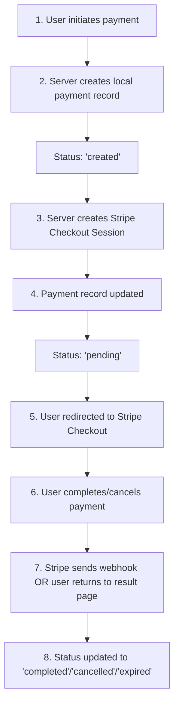

# Stripe Sandbox to Production Migration Checklist

This document provides guidance for migrating from Stripe Sandbox (test) mode to Live (production) mode.

---

## Code Review Summary

The Stripe integration has been reviewed and is **production-ready**. No code changes are required.

### Products: Dynamically Created

Products are created inline with each checkout session using `price_data.product_data`. No hardcoded product IDs exist that would need migration.

**Location:** `server/payments/stripeService.js:49-58`

### Customers: Not Stored in Stripe

Customer information is tracked only in the local `StripePayments` database table. No Stripe Customer objects exist that would need migration.

**Location:** `server/payments/paymentsController.js:217-228`

---

## Pre-Production Checklist

### Stripe Dashboard Configuration

- [ ] Switch to Live mode in Stripe Dashboard (click "Switch to live account")
- [ ] Copy Live secret key (`sk_live_*`) - **can only be revealed once**
- [ ] Create new webhook endpoint for Live mode (sandbox webhooks don't work in live)
- [ ] Copy Live webhook signing secret (`whsec_*`)

### Server Configuration

Update `server/serverConfig.json`:

```json
"stripe": {
    "enabled": true,
    "secretKey": "sk_live_YOUR_LIVE_SECRET_KEY",
    "webhookSecret": "whsec_YOUR_LIVE_WEBHOOK_SECRET",
    "baseUrl": "https://your-production-domain.com",
    "logFolderPath": "C:\\logs\\stripe"
}
```

- [ ] Update `secretKey` with live key
- [ ] Update `webhookSecret` with live webhook secret
- [ ] Verify `baseUrl` is correct for production
- [ ] Set `enabled` to `true`
- [ ] Configure `logFolderPath` for production logging (optional)
- [ ] Restart server

### Stripe Account Verification

- [ ] Business details complete and verified
- [ ] Bank account connected for payouts
- [ ] Identity verification passed
- [ ] All required currencies enabled
- [ ] Review payout schedule settings

### Webhook Configuration

Create webhook in Stripe Live mode pointing to:
```
https://your-production-domain.com/api/payments/webhook
```

Subscribe to these events:
- `checkout.session.completed`
- `checkout.session.expired`

**Note:** The `payment_intent.payment_failed` event is also handled but is optional for card-only payments.

### Live Mode Testing

- [ ] Make a small real payment (e.g., 1.00 EUR)
- [ ] Verify webhook receives `checkout.session.completed` event
- [ ] Verify payment status updates to "completed" in database
- [ ] Verify receipt URL is captured
- [ ] Process a refund in Stripe dashboard to recover test amount

---

## Important Differences: Sandbox vs Live

| Aspect | Sandbox Mode | Live Mode |
|--------|--------------|-----------|
| Key prefix | `sk_test_` | `sk_live_` |
| Webhook secret | `whsec_` | `whsec_` |
| Secret key reveal | Multiple times | **Once only** |
| Payments | Test/simulated | Real money |
| Webhooks | Separate endpoint | Separate endpoint |

---

## Potential Issues

### Critical

| Issue | Impact | Action |
|-------|--------|--------|
| Webhook secret must be new | Payments fail silently | Create new webhook in Live dashboard |
| Live secret key revealed once | If lost, must regenerate | Copy immediately, store securely |

### High Priority

| Issue | Impact | Action |
|-------|--------|--------|
| Account not verified | Payments may fail | Complete business verification |
| Currency not supported | Payments fail for some customers | Verify currencies in Stripe account |

### Medium Priority

| Issue | Impact | Action |
|-------|--------|--------|
| Test data not available | Clean slate | Expected behavior |
| Rate limits | Potential throttling | Current settings are conservative |

---

## Supported Currencies

The following currencies are configured in `server/payments/currencyMapping.js`:

| Code | Currency | Stripe Symbol |
|------|----------|---------------|
| 0 | Euro | EUR |
| 1 | US Dollar | USD |
| 11 | Canadian Dollar | CAD |
| 44 | British Pound | GBP |
| 45 | Danish Krone | DKK |
| 46 | Swedish Krona | SEK |
| 61 | Australian Dollar | AUD |
| 64 | New Zealand Dollar | NZD |
| 65 | Singapore Dollar | SGD |
| 81 | Japanese Yen | JPY |
| 86 | Chinese Yuan | CNY |
| 271 | South African Rand | ZAR |
| 852 | Hong Kong Dollar | HKD |

Verify your Stripe live account supports all currencies your customers use.

---

## Payment Flow Reference



---

## Related Documentation

- [Developer Access Guide](./developer-access) - Guide for clients to invite developers
- [Configuration Guide](./configuration) - Initial setup guide
- [User Guide](./user-guide) - End user guide
