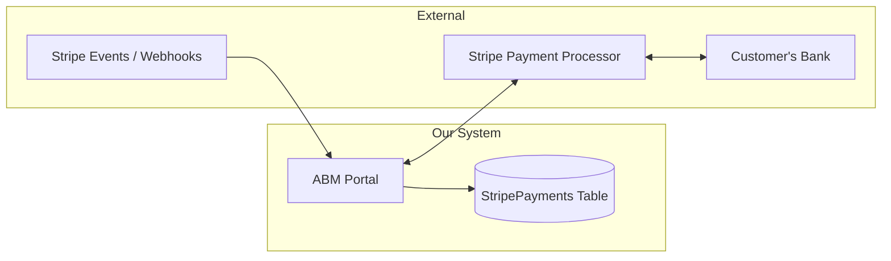
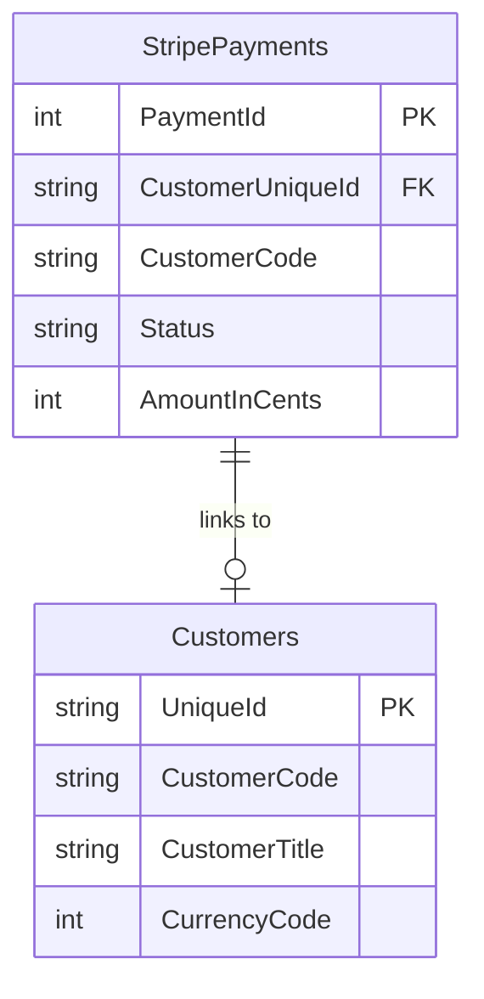
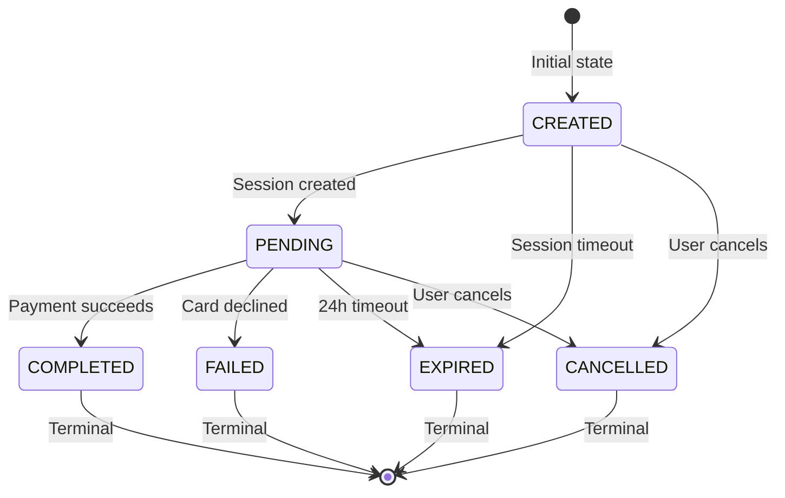
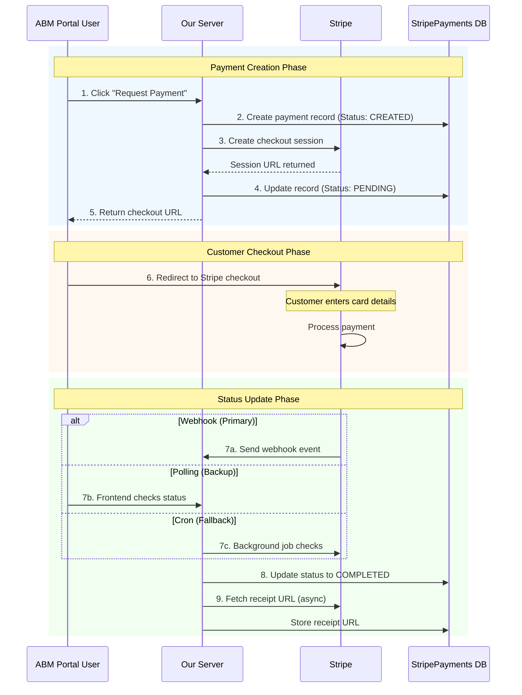

# Stripe Payment Integration - Technical Support Guide

This guide is for the support team to understand the technical aspects of the Stripe payment system. It covers the database structure, payment statuses, workflow, and troubleshooting.

---

## Table of Contents

1. [System Overview](#1-system-overview)
2. [The StripePayments Table](#2-the-stripepayments-table)
3. [Payment Status Lifecycle](#3-payment-status-lifecycle)
4. [Payment Workflow Diagram](#4-payment-workflow-diagram)
5. [What Gets Updated and When](#5-what-gets-updated-and-when)
6. [The Happy Path](#6-the-happy-path)
7. [Edge Cases and How the System Handles Them](#7-edge-cases-and-how-the-system-handles-them)
8. [Troubleshooting Guide](#8-troubleshooting-guide)
9. [Quick Reference](#9-quick-reference)

---

## 1. System Overview

The Stripe payment system allows customers to pay via credit/debit card. There are three main components working together:



**How payments flow:**
1. User creates a payment request in ABM Portal
2. Portal creates a Stripe checkout session
3. Customer is redirected to Stripe's secure payment page
4. Customer enters card details and pays
5. Stripe notifies our system (via webhook) when payment completes
6. Portal updates the StripePayments table

---

## 2. The StripePayments Table

This is the main table that stores all payment information. Understanding each column is essential for troubleshooting.

### Column Reference

| Column | Description | Example Value |
|--------|-------------|---------------|
| **PaymentId** | Unique internal ID (auto-generated) | `1`, `2`, `3`... |
| **IdempotencyKey** | Prevents duplicate payments on retry | `pay_abc123_1704795600000` |
| **CustomerUniqueId** | Links to the Customers table | `CUST001` |
| **CustomerCode** | Customer's short code for reference | `000001` |
| **StripeSessionId** | Stripe's checkout session ID | `cs_test_a1b2c3...` |
| **StripePaymentIntentId** | Stripe's payment intent ID | `pi_3abc123...` |
| **StripeSessionUrl** | The checkout URL the customer visited | `https://checkout.stripe.com/...` |
| **AmountInCents** | Payment amount in smallest currency unit | `2550` (= EUR 25.50) |
| **Currency** | 3-letter currency code | `EUR`, `USD`, `GBP` |
| **ReferenceText** | User-entered reference (invoice number) | `Invoice #2024-001` |
| **Status** | Current payment status | `created`, `pending`, `completed` |
| **CreatedAt** | When payment was initiated | `2025-01-09 10:30:00` |
| **UpdatedAt** | Last status change time | `2025-01-09 10:35:00` |
| **CompletedAt** | When payment succeeded (if applicable) | `2025-01-09 10:35:00` |
| **ExpiresAt** | When the checkout session expires | `2025-01-10 10:30:00` |
| **CreatedByEmail** | Email of user who initiated payment | `john@abm.com` |
| **SourceRole** | Who initiated: `abm` or `external` | `abm` |
| **StripeEventId** | ID of Stripe webhook event that updated status | `evt_abc123...` |
| **StripeReceiptUrl** | Link to downloadable receipt | `https://receipts.stripe.com/...` |
| **FailureReason** | Error message if payment failed | `Card was declined` |
| **LatestStatusUpdateSource** | What triggered the last update | `webhook`, `polling`, `cron` |

### Understanding AmountInCents

The amount is always stored in the **smallest currency unit** (cents/pence):

| Currency | Amount Shown | AmountInCents |
|----------|--------------|---------------|
| EUR 25.50 | Twenty-five euros fifty cents | `2550` |
| USD 100.00 | One hundred dollars | `10000` |
| GBP 10.99 | Ten pounds ninety-nine pence | `1099` |
| JPY 1000 | One thousand yen | `1000` (no conversion*) |

*Japanese Yen and some other currencies have no decimal places.

### Key Relationships



---

## 3. Payment Status Lifecycle

### Status Definitions

| Status | UI Color | Meaning |
|--------|----------|---------|
| **CREATED** | Blue | Payment request initiated, checkout session being set up |
| **PENDING** | Yellow | Customer redirected to Stripe, waiting for payment |
| **COMPLETED** | Green | Payment successful, money received |
| **FAILED** | Red | Card declined or payment error |
| **CANCELLED** | Red | Customer clicked cancel on checkout page |
| **EXPIRED** | Grey | Customer didn't complete payment within 24 hours |

### Status Transition Diagram



### Valid Status Transitions

| From Status | Can Change To |
|-------------|---------------|
| CREATED | PENDING, EXPIRED, CANCELLED |
| PENDING | COMPLETED, FAILED, EXPIRED, CANCELLED |
| COMPLETED | Nothing (final state) |
| FAILED | Nothing (final state) |
| EXPIRED | Nothing (final state) |
| CANCELLED | Nothing (final state) |

**Important:** Once a payment reaches COMPLETED, FAILED, EXPIRED, or CANCELLED, it cannot change to any other status. These are called "terminal states."

---

## 4. Payment Workflow Diagram

### Complete Payment Flow



### Three Ways Status Gets Updated

The system has three mechanisms to detect payment completion. This redundancy ensures no payment is missed:

| Method | How It Works | When It's Used |
|--------|--------------|----------------|
| **Webhook** | Stripe sends a notification to our server | Primary method, fastest |
| **Polling** | Frontend asks server "is it done yet?" | Backup, after customer returns |
| **Cron** | Background job checks every 5 minutes | Fallback, catches missed webhooks |

The `LatestStatusUpdateSource` column shows which method updated the payment:
- `webhook` - Updated by Stripe webhook
- `polling` - Updated when frontend checked status
- `cron` - Updated by background processor

---

## 5. What Gets Updated and When

### Phase 1: Payment Creation

When a user clicks "Request Payment":

| Column | Value Set | Notes |
|--------|-----------|-------|
| Status | `created` | Initial state |
| CustomerUniqueId | From selected customer | Links to Customers table |
| CustomerCode | Customer's code | e.g., `000001` |
| AmountInCents | Entered amount x 100 | e.g., 25.50 becomes 2550 |
| Currency | From customer's account | e.g., `EUR` |
| ReferenceText | User-entered reference | e.g., `Invoice #2024-001` |
| IdempotencyKey | Auto-generated | Prevents duplicates |
| CreatedByEmail | Logged-in user's email | Audit trail |
| SourceRole | `abm` or `external` | Who initiated |
| CreatedAt | Current timestamp | Auto-set |

### Phase 2: Session Created

After Stripe returns the checkout session:

| Column | Value Set | Notes |
|--------|-----------|-------|
| Status | `pending` | Changed from `created` |
| StripeSessionId | From Stripe | e.g., `cs_test_abc123` |
| StripeSessionUrl | Checkout URL | Where customer goes |
| ExpiresAt | Current time + 24 hours | Session timeout |
| UpdatedAt | Current timestamp | Status change time |

### Phase 3: Payment Completed

When payment succeeds (via webhook, polling, or cron):

| Column | Value Set | Notes |
|--------|-----------|-------|
| Status | `completed` | Changed from `pending` |
| CompletedAt | Current timestamp | When money was received |
| StripePaymentIntentId | From Stripe | e.g., `pi_xyz789` |
| StripeEventId | Webhook event ID | For duplicate prevention |
| LatestStatusUpdateSource | `webhook`/`polling`/`cron` | What triggered update |
| UpdatedAt | Current timestamp | Last update time |
| StripeReceiptUrl | Receipt link | Fetched asynchronously |

### Phase 4: Payment Failed/Expired/Cancelled

Depending on the outcome:

**If Failed:**

| Column | Value Set |
|--------|-----------|
| Status | `failed` |
| FailureReason | Error message from Stripe |
| UpdatedAt | Current timestamp |

**If Expired:**

| Column | Value Set |
|--------|-----------|
| Status | `expired` |
| UpdatedAt | Current timestamp |

**If Cancelled:**

| Column | Value Set |
|--------|-----------|
| Status | `cancelled` |
| UpdatedAt | Current timestamp |

---

## 6. The Happy Path

This is what a successful payment looks like in the database:

### Timeline Example

```
10:30:00  User clicks "Request Payment" for EUR 50.00
          |
          v
+---------------------------------------------------------------------+
| PaymentId: 1                                                        |
| Status: CREATED                                                     |
| AmountInCents: 5000                                                 |
| Currency: EUR                                                       |
| ReferenceText: Invoice #2024-001                                    |
| CreatedAt: 2025-01-09 10:30:00                                      |
| CreatedByEmail: john@abm.com                                        |
| SourceRole: abm                                                     |
| IdempotencyKey: pay_CUST001_1736418600000                           |
+---------------------------------------------------------------------+
          |
10:30:01  Stripe session created
          |
          v
+---------------------------------------------------------------------+
| PaymentId: 1                                                        |
| Status: PENDING  <-- Changed                                        |
| StripeSessionId: cs_test_a1kXjgfZ8B9m...  <-- Added                |
| StripeSessionUrl: https://checkout.stripe.com/...  <-- Added       |
| ExpiresAt: 2025-01-10 10:30:01  <-- Added (24 hours later)         |
| UpdatedAt: 2025-01-09 10:30:01  <-- Added                          |
| ... (other fields unchanged)                                        |
+---------------------------------------------------------------------+
          |
10:30:02  Customer redirected to Stripe checkout page
          |
          |  (Customer enters card details)
          |
10:32:15  Customer clicks "Pay" - Payment succeeds
          |
          v
+---------------------------------------------------------------------+
| PaymentId: 1                                                        |
| Status: COMPLETED  <-- Changed                                      |
| CompletedAt: 2025-01-09 10:32:15  <-- Added                        |
| StripePaymentIntentId: pi_3Qc8x9A...  <-- Added                    |
| StripeEventId: evt_1Qc8xABC...  <-- Added                          |
| LatestStatusUpdateSource: webhook  <-- Added                        |
| UpdatedAt: 2025-01-09 10:32:15  <-- Updated                        |
| StripeReceiptUrl: https://receipts.stripe.com/...  <-- Added       |
| ... (other fields unchanged)                                        |
+---------------------------------------------------------------------+
```

### Verifying a Successful Payment

A completed payment should have:

- [ ] Status = `completed`
- [ ] CompletedAt has a value
- [ ] StripePaymentIntentId starts with `pi_`
- [ ] StripeReceiptUrl is available (may take a few seconds)
- [ ] LatestStatusUpdateSource shows how it was updated

---

## 7. Edge Cases and How the System Handles Them

### Edge Case 1: Customer's Browser Crashes During Payment

**Scenario:** Customer enters card details, clicks Pay, but their browser crashes before seeing the result.

**What happens:**
1. The payment may have succeeded on Stripe's side
2. Customer doesn't see the success page
3. Our webhook still receives the `checkout.session.completed` event
4. Payment status is updated to `completed` via webhook

**How to verify:** Check if Status = `completed` and LatestStatusUpdateSource = `webhook`

**Resolution:** Payment was successful. Customer can view receipt via StripeReceiptUrl.

---

### Edge Case 2: Webhook Fails to Arrive

**Scenario:** Network issues prevent Stripe's webhook from reaching our server.

**What happens:**
1. Payment succeeds on Stripe
2. Webhook doesn't arrive (or fails to process)
3. Status remains `pending`
4. Background cron job runs every 5 minutes
5. Cron checks Stripe for actual payment status
6. Status updated to `completed` by cron

**How to verify:** LatestStatusUpdateSource = `cron` instead of `webhook`

**Timeframe:** Payment will be detected within 5 minutes max.

---

### Edge Case 3: Customer Abandons Checkout

**Scenario:** Customer is redirected to Stripe but never enters card details.

**What happens:**
1. Status stays `pending`
2. After 24 hours, Stripe expires the session
3. Stripe sends `checkout.session.expired` webhook
4. Status updated to `expired`

**How to verify:** Status = `expired` and CompletedAt is NULL.

**Resolution:** Customer needs to initiate a new payment.

---

### Edge Case 4: Card Declined

**Scenario:** Customer's card has insufficient funds or is blocked.

**What happens:**
1. Customer enters card details and clicks Pay
2. Bank declines the card
3. Stripe shows error to customer
4. Customer can try again with different card
5. If they give up, session eventually expires

**How to verify:** If they eventually fail out:
- Status = `failed` or `expired`
- FailureReason may contain error message

**Resolution:** Customer should try with a different card or contact their bank.

---

### Edge Case 5: Network Retry Creates Duplicate Request

**Scenario:** User clicks "Request Payment" but network is slow. They click again.

**What happens:**
1. First request creates payment with IdempotencyKey
2. Second request arrives with same IdempotencyKey
3. System detects duplicate via IdempotencyKey
4. Returns existing StripeSessionUrl instead of creating new payment

**How to verify:** Only one record exists in StripePayments for that IdempotencyKey.

**Protection:** The IdempotencyKey prevents duplicate charges.

---

### Edge Case 6: Payment Stuck in CREATED Status

**Scenario:** Payment was created but Stripe session was never set up.

**What happens:**
1. Record created with Status = `created`
2. Error occurred calling Stripe API
3. Status never moved to `pending`
4. StripeSessionId is NULL
5. After 5 minutes, cron marks it as `failed`

**How to verify:**
- Status = `created` (if recent) or `failed` (if >5 min old)
- StripeSessionId is NULL or empty
- FailureReason = "Session creation timed out"

**Resolution:** User should try creating a new payment.

---

### Edge Case 7: Amount Validation Failures

**Scenario:** User tries to process an invalid amount.

| Condition | Result |
|-----------|--------|
| Amount < 0.50 | Rejected: "Minimum payment is 0.50" |
| Amount > 50,000 | Rejected: "Maximum payment is 50,000" |
| Amount is negative | Rejected before payment created |
| Amount is 0 | Rejected before payment created |

**How to verify:** No record created in StripePayments if rejected early.

---

## 8. Troubleshooting Guide

### Problem: Payment Shows PENDING But Customer Says They Paid

**Check these in order:**

1. **Verify in Stripe Dashboard**
   - Go to dashboard.stripe.com
   - Search for the customer or session ID
   - Check if payment shows as "Succeeded" in Stripe

2. **If Stripe shows "Succeeded" but our system shows PENDING:**
   - Webhook may have failed
   - Wait up to 5 minutes for cron to catch it
   - Or manually trigger a status check by refreshing the payment page

3. **Check LatestStatusUpdateSource:**
   - NULL = webhook hasn't processed yet
   - If it shows a source but status is still pending, there may be a bug

### Problem: Payment Failed But No FailureReason

**Possible causes:**
- Session expired (no failure, just timeout)
- Customer cancelled (clicked cancel button)
- Webhook for failure event wasn't configured

**Check:**
- Look at Status: `expired` or `cancelled` don't have failure reasons
- Only `failed` status should have FailureReason

### Problem: Customer Can't Find Their Receipt

**Check:**
- Is StripeReceiptUrl populated?
- Receipt is fetched asynchronously, may take a few seconds
- If NULL after 24 hours, receipt fetch may have failed
- Customer can also find receipt in their email (if email receipts enabled in Stripe)

### Problem: Duplicate Payments in Database

**This shouldn't happen, but if it does:**
1. Check if they have different IdempotencyKeys (different payment attempts)
2. Check if they have the same StripeSessionId (indicates a bug)
3. Only one should be `completed` - the other should be `expired` or `failed`

### Problem: Payment Shows Amount Doesn't Match What Customer Paid

**Check:**
- AmountInCents is in cents, not currency units
- Divide by 100 to get the actual amount
- Example: 2550 = EUR 25.50

---

## 9. Quick Reference

### Status at a Glance

| Status | Color | Next Step |
|--------|-------|-----------|
| CREATED | Blue | Wait - session being created |
| PENDING | Yellow | Customer is on checkout page |
| COMPLETED | Green | Done - money received |
| FAILED | Red | Payment rejected - try again |
| CANCELLED | Red | Customer cancelled - try again |
| EXPIRED | Grey | Took too long - try again |

### Key Columns for Troubleshooting

| What You Need | Column to Check |
|---------------|-----------------|
| Current status | Status |
| When payment completed | CompletedAt |
| How status was updated | LatestStatusUpdateSource |
| Why it failed | FailureReason |
| Receipt link | StripeReceiptUrl |
| Who initiated payment | CreatedByEmail, SourceRole |
| Payment amount | AmountInCents / 100 |

### ID Prefixes

| Prefix | Meaning | Example |
|--------|---------|---------|
| `cs_` | Checkout Session ID | `cs_test_a1b2c3...` |
| `pi_` | Payment Intent ID | `pi_3abc123...` |
| `evt_` | Stripe Event ID | `evt_1xyz789...` |
| `whsec_` | Webhook Secret | (config only) |
| `sk_test_` | Test API Key | (config only) |
| `sk_live_` | Live API Key | (config only) |

### Important Timeframes

| Event | Timeframe |
|-------|-----------|
| Checkout session expiry | 24 hours after creation |
| Stuck "created" timeout | 5 minutes |
| Background cron check | Every 5 minutes |

---

## Related Documentation

- [User Guide](./user-guide) - End user guide for making payments
- [Configuration Guide](./configuration) - Server configuration setup
- [Production Checklist](./production-checklist) - Going live checklist
- [Developer Access Guide](./developer-access) - Developer access for clients
