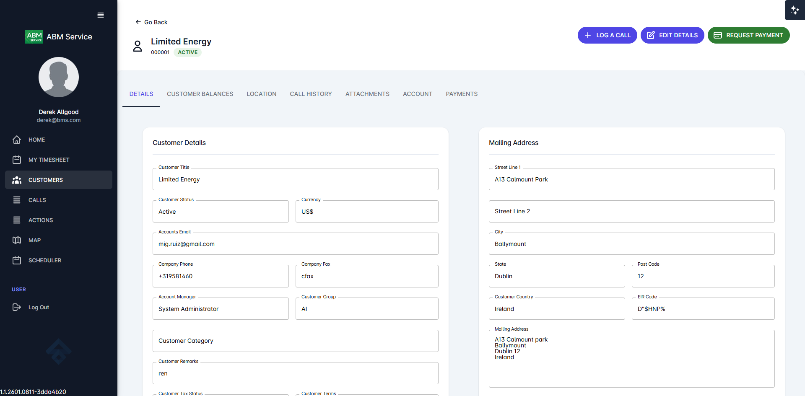
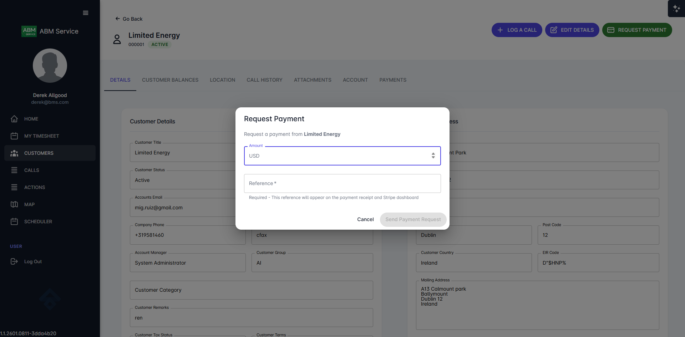
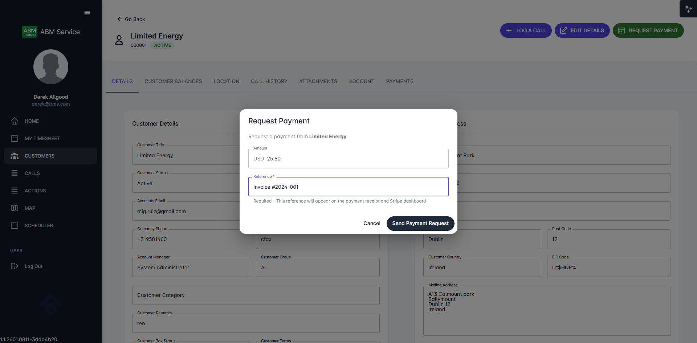
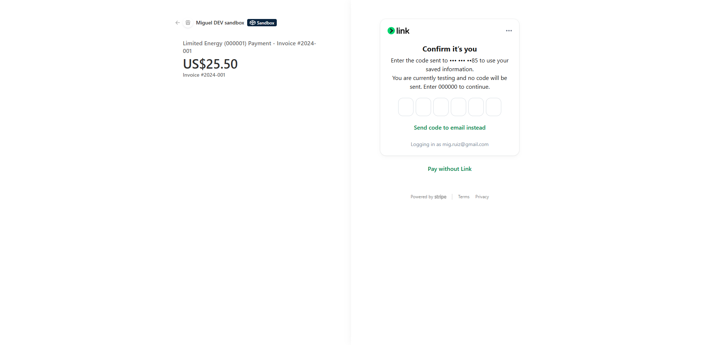
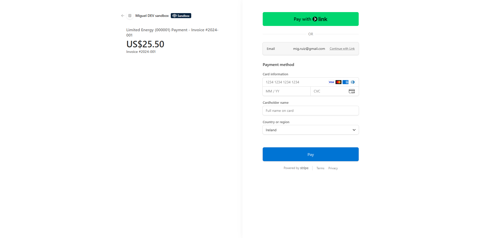
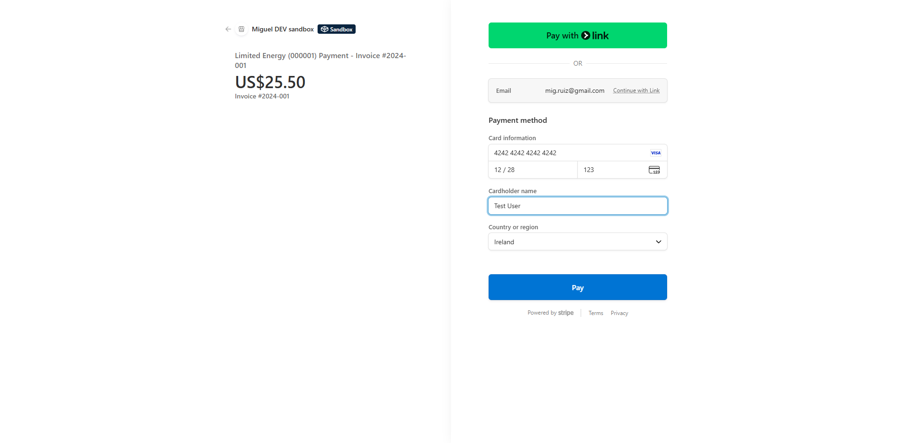
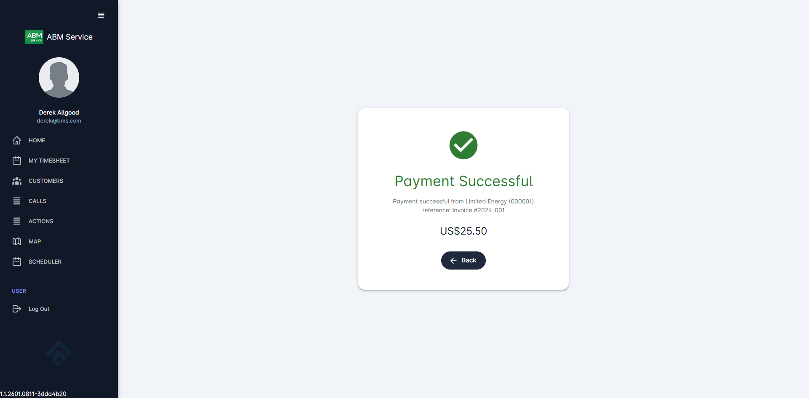
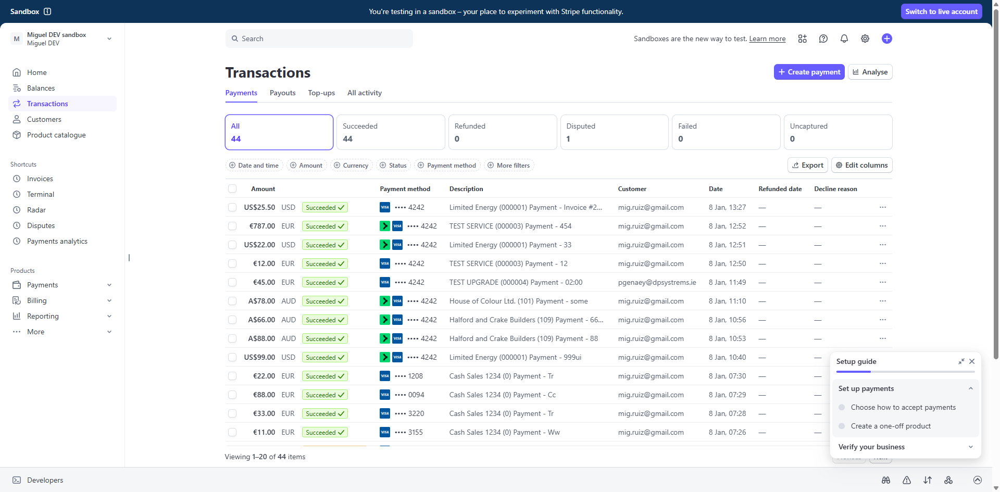

# Stripe Payment Integration - User Guide

This guide explains how to use the payment feature in ABM Service Web Portal. The system supports two types of users with different payment workflows.

---

## Table of Contents

1. [ABM Users - Request Payment](#section-1-abm-users---request-payment)
2. [External Users - Make Payment](#section-2-external-users---make-payment)
3. [Viewing Payments in Stripe Dashboard](#section-3-viewing-payments-in-stripe-dashboard)
4. [Payment Status Reference](#payment-status-reference)

---

## Section 1: ABM Users - Request Payment

ABM (internal) users can request payments from customers on their behalf. This is typically used when processing payments over the phone or when assisting a customer with their account.

### Step 1: Navigate to the Customer

1. Log in to the ABM Service Web Portal with your ABM credentials
2. Click on **CUSTOMERS** in the left navigation menu
3. Search for and select the customer you want to process a payment for

*Customer details page showing the REQUEST PAYMENT button in the top right corner*

### Step 2: Open the Payment Dialog

Click the **REQUEST PAYMENT** button (purple button) in the top right corner of the customer page.

*The Request Payment dialog showing the amount and reference fields*

### Step 3: Enter Payment Details

Fill in the payment information:

1. **Amount**: Enter the payment amount (the currency is automatically set based on the customer's account)
2. **Reference**: Enter a reference for this payment (required) - for example, an invoice number like "Invoice #2024-001"

The reference will appear on the payment receipt and in the Stripe dashboard for tracking purposes.

*Payment dialog with amount (USD 25.50) and reference (Invoice #2024-001) filled in*

### Step 4: Proceed to Stripe Checkout

Click **Send Payment Request**. You will be redirected to Stripe's secure checkout page.

*Stripe checkout page showing the payment details*

### Step 5: Enter Card Details

On the Stripe checkout page:

1. You can use **Pay with Link** for faster checkout if you have a Link account, OR
2. Enter card details manually:
   - Card number
   - Expiration date (MM/YY)
   - CVC code
   - Cardholder name
   - Country

*Stripe payment form showing card input fields*

*Stripe payment form with card details entered*

### Step 6: Complete Payment

Click the **Pay** button to process the payment. After successful payment, you will be redirected to the confirmation page.

*Payment successful confirmation page*

The confirmation page shows:
- A green checkmark indicating success
- The customer name and code
- The payment reference
- The amount paid

### Step 7: Return to Customer Page

Click the **Back** button to return to the customer page.

### Step 8: View Payment History

Navigate to the **PAYMENTS** tab on the customer page to see all payment history for this customer.

*PAYMENTS tab showing the completed payment with status, amount, and receipt link*

The payment history shows:
- **Date**: When the payment was made
- **Reference**: The payment reference you entered
- **Amount**: The payment amount and currency
- **Status**: Payment status (COMPLETED, PENDING, etc.)
- **Created By**: The email of the user who initiated the payment
- **Receipt**: Link to view the Stripe receipt

---

## Section 2: External Users - Make Payment

External users (customers) can make payments directly from their customer portal. This allows customers to pay their invoices or make account payments at any time.

### Step 1: Navigate to Your Company

1. Log in to the ABM Service Web Portal with your external user credentials
2. Click on **CUSTOMERS** in the left navigation menu
3. Select your company from the list

*External user view showing company details and the MAKE PAYMENT button*

### Step 2: Open the Payment Dialog

Click the **MAKE PAYMENT** button (green button) in the top right corner.

*Make a Payment dialog for external users*

### Step 3: Enter Payment Details

Fill in the payment information:

1. **Amount**: Enter the amount you wish to pay
2. **Reference**: Enter a reference for your records (required) - for example, an invoice number

### Step 4: Proceed to Payment

Click **Proceed to Payment**. You will be redirected to Stripe's secure checkout page.

### Step 5: Complete Payment

Enter your card details on the Stripe checkout page and click **Pay** to complete the payment.

### Step 6: View Confirmation

After successful payment, you will see the confirmation page with payment details.

### Step 7: View Payment History

Click **Back** to return to your company page, then navigate to the **MY PAYMENTS** tab to see your payment history.

*MY PAYMENTS tab showing payment history for external users*

---

## Section 3: Viewing Payments in Stripe Dashboard

Administrators can view all payment transactions in the Stripe Dashboard for reconciliation and reporting purposes.

### Accessing the Stripe Dashboard

1. Log in to the Stripe Dashboard at [dashboard.stripe.com](https://dashboard.stripe.com)
2. Navigate to **Transactions** in the left menu

*Stripe Transactions page showing all payments*

### Viewing Payment Details

Click on any payment to view its details:

*Payment details page showing transaction information*

The payment details page shows:
- Payment amount and status
- Customer information
- Checkout summary with line items
- Payment breakdown (fees, net amount)
- Payment method details
- Timeline of events

### Understanding Payment Metadata

Each payment includes metadata that links it back to the ABM Service Portal:

*Metadata section showing portal-specific information*

The metadata includes:

| Field | Description |
|-------|-------------|
| **createdByEmail** | Email of the user who initiated the payment |
| **customerCode** | The customer code in the portal (e.g., "000001") |
| **customerId** | The unique customer ID in the system |
| **customerName** | The customer's name (e.g., "Limited Energy") |
| **paymentId** | The internal payment ID in the portal |
| **reference** | The payment reference entered by the user |
| **sourceRole** | Who initiated the payment: "abm" (internal user) or "external" (customer) |

This metadata makes it easy to:
- Track which portal user processed the payment
- Match payments to customer accounts
- Reconcile payments with invoices using the reference field
- Distinguish between internally-processed and customer-initiated payments

---

## Payment Status Reference

Payments in the portal can have the following statuses:

| Status | Color | Description |
|--------|-------|-------------|
| **COMPLETED** | Green | Payment was successful |
| **PENDING** | Yellow | Payment is being processed |
| **CREATED** | Blue | Payment session created, awaiting completion |
| **FAILED** | Red | Payment failed (see failure reason) |
| **CANCELLED** | Red | Payment was cancelled by the user |
| **EXPIRED** | Grey | Payment session expired before completion |

---

## Need Help?

If you encounter any issues with payments:

1. **For ABM Users**: Contact your system administrator
2. **For External Users**: Contact your account manager at ABM
3. **For Payment Issues**: Check the payment status in the PAYMENTS/MY PAYMENTS tab. If a payment shows as FAILED, you can try again with a new payment request.
