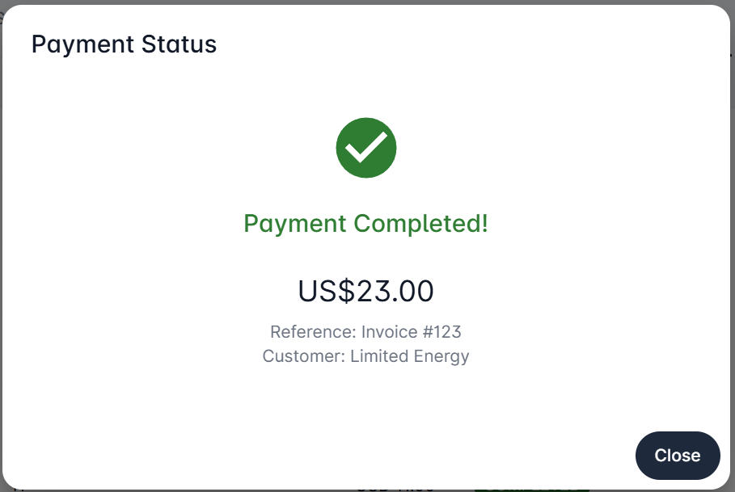
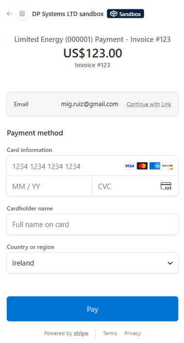
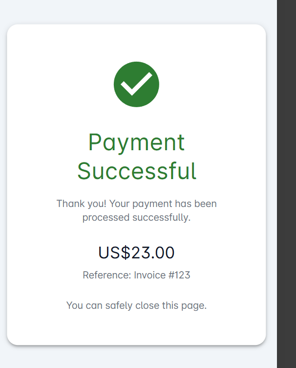
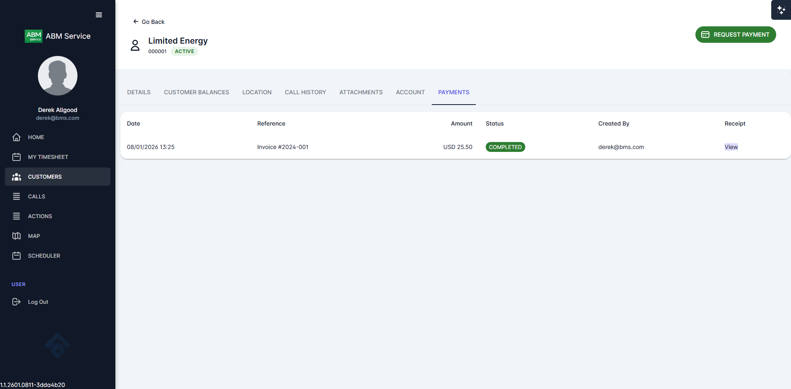
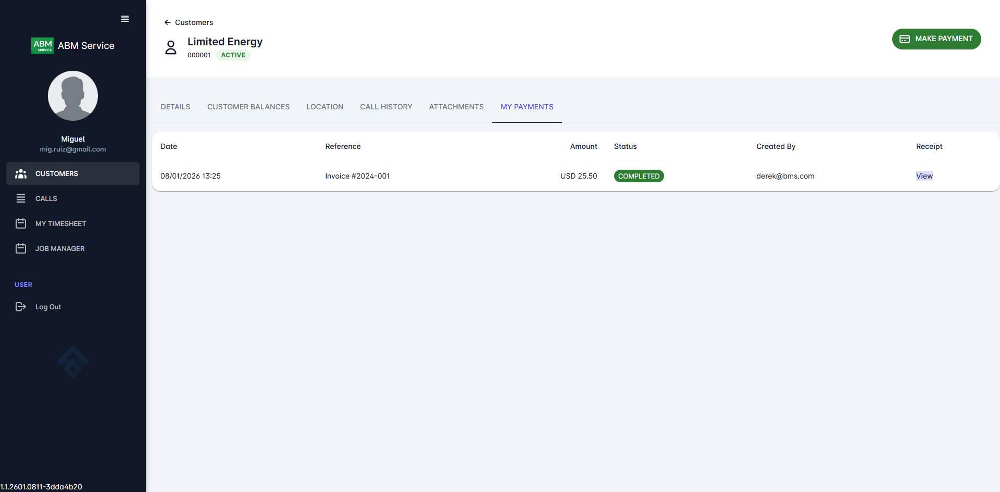

# Stripe Payment Integration - User Guide

This guide explains how to use the payment feature in ABM Service Web Portal. The system supports two types of users with different payment workflows.

---

## Table of Contents

1. [ABM Users - Request Payment](#section-1-abm-users---request-payment)
2. [External Users - Make Payment](#section-2-external-users---make-payment)
3. [Viewing Payments in Stripe Dashboard](#section-3-viewing-payments-in-stripe-dashboard)
4. [Payment Status Reference](#payment-status-reference)

---

## Section 1: ABM Users - Request Payment

ABM (internal) users can request payments from customers on their behalf. With the new payment flow, ABM users generate a payment link that customers can use to complete payment securely on their own device. This is ideal for phone-based customer service, email follow-ups, or in-person transactions where the customer prefers to use their own device.

### Step 1: Navigate to the Customer

1. Log in to the ABM Service Web Portal with your ABM credentials
2. Click on **CUSTOMERS** in the left navigation menu
3. Search for and select the customer you want to process a payment for

*Customer details page showing the REQUEST PAYMENT button in the top right corner*

### Step 2: Open the Payment Dialog

Click the **REQUEST PAYMENT** button (purple button) in the top right corner of the customer page.

### Step 3: Enter Payment Details

Fill in the payment information:

1. **Amount**: Enter the payment amount (the currency is automatically set based on the customer's account)
2. **Reference**: Enter a reference for this payment (required) - for example, an invoice number like "Invoice #123"

Click **Send Payment Request** to generate the payment link.

### Step 4: Share the Payment Link

After submitting, the **Payment Link Ready** dialog appears with multiple options to share the payment link with the customer:

*Payment Link Ready dialog showing QR code, payment amount, reference, and sharing options*

The dialog displays:
- **QR Code**: The customer can scan this with their phone camera to open the payment page
- **Payment Amount**: The amount and reference for verification
- **Payment Link**: A text field with the Stripe checkout URL and a copy button
- **Share Button**: Opens the device's native share menu to send via SMS, email, or messaging apps
- **Done Button**: Proceeds to monitor the payment status

**Options to share the payment link:**

1. **Show the QR Code**: If the customer is present, they can scan the QR code with their phone
2. **Copy the Link**: Click the copy button to copy the URL, then paste it into an email, chat, or SMS
3. **Use Native Share**: Click the **Share** button to use your device's share functionality

Once the link is shared with the customer, click **Done** to proceed.

### Step 5: Wait for Customer Payment

After clicking **Done**, a **Payment Status** dialog appears that monitors the payment in real-time:

*Payment Status dialog showing waiting state with payment details and polling indicator*

The dialog shows:
- **Status indicator**: A loading spinner while waiting
- **Payment details**: Amount, reference, and customer name
- **Polling status**: The system checks for payment completion every 8 seconds
- **Stop Waiting button**: Click to close the dialog and check status later

You can leave this dialog open while the customer completes payment, or click **Stop Waiting** to close it. The payment status will update in the payments history regardless.

### Step 6: Payment Completed

When the customer completes payment, the dialog automatically updates to show the confirmation:

*Payment Status dialog showing successful payment completion*

The confirmation shows:
- A green checkmark indicating success
- **Payment Completed!** status
- The payment amount, reference, and customer name

Click **Close** to return to the customer page. The payments grid will automatically refresh to show the new payment.

### Customer Experience

When the customer opens the payment link (via QR code scan or direct link), they see the Stripe checkout page:

*Stripe checkout page as seen by the customer, showing payment details and card entry form*

The customer can:
- Use **Continue with Link** for faster checkout if they have a Stripe Link account
- Enter card details manually (card number, expiration, CVC, name, country)
- Click **Pay** to complete the payment

After successful payment, the customer sees a confirmation page:

*Payment successful page shown to the customer after completing payment*

The customer can safely close this page after seeing the confirmation.

### Step 7: View Payment History

Navigate to the **PAYMENTS** tab on the customer page to see all payment history for this customer.

*PAYMENTS tab showing the completed payment with status, amount, and receipt link*

The payment history shows:
- **Date**: When the payment was made
- **Reference**: The payment reference you entered
- **Amount**: The payment amount and currency
- **Status**: Payment status (COMPLETED, PENDING, etc.)
- **Created By**: The email of the user who initiated the payment
- **Receipt**: Link to view the Stripe receipt

**Tip**: For pending payments, you can click "Show Payment Link" in the actions menu to display the QR code again if you need to re-share it with the customer.

---

## Section 2: External Users - Make Payment

External users (customers) can make payments directly from their customer portal. This allows customers to pay their invoices or make account payments at any time.

### Step 1: Navigate to Your Company

1. Log in to the ABM Service Web Portal with your external user credentials
2. Click on **CUSTOMERS** in the left navigation menu
3. Select your company from the list

*External user view showing company details and the MAKE PAYMENT button*

### Step 2: Open the Payment Dialog

Click the **MAKE PAYMENT** button (green button) in the top right corner.

*Make a Payment dialog for external users*

### Step 3: Enter Payment Details

Fill in the payment information:

1. **Amount**: Enter the amount you wish to pay
2. **Reference**: Enter a reference for your records (required) - for example, an invoice number

### Step 4: Proceed to Payment

Click **Proceed to Payment**. You will be redirected to Stripe's secure checkout page.

### Step 5: Complete Payment

Enter your card details on the Stripe checkout page and click **Pay** to complete the payment.

### Step 6: View Confirmation

After successful payment, you will see the confirmation page with payment details.

### Step 7: View Payment History

Click **Back** to return to your company page, then navigate to the **MY PAYMENTS** tab to see your payment history.

*MY PAYMENTS tab showing payment history for external users*

---

## Section 3: Viewing Payments in Stripe Dashboard

Administrators can view all payment transactions in the Stripe Dashboard for reconciliation and reporting purposes.

### Accessing the Stripe Dashboard

1. Log in to the Stripe Dashboard at [dashboard.stripe.com](https://dashboard.stripe.com)
2. Navigate to **Transactions** in the left menu

*Stripe Transactions page showing all payments*

### Viewing Payment Details

Click on any payment to view its details:

*Payment details page showing transaction information*

The payment details page shows:
- Payment amount and status
- Customer information
- Checkout summary with line items
- Payment breakdown (fees, net amount)
- Payment method details
- Timeline of events

### Understanding Payment Metadata

Each payment includes metadata that links it back to the ABM Service Portal:

*Metadata section showing portal-specific information*

The metadata includes:

| Field | Description |
|-------|-------------|
| **createdByEmail** | Email of the user who initiated the payment |
| **customerCode** | The customer code in the portal (e.g., "000001") |
| **customerId** | The unique customer ID in the system |
| **customerName** | The customer's name (e.g., "Limited Energy") |
| **paymentId** | The internal payment ID in the portal |
| **reference** | The payment reference entered by the user |
| **sourceRole** | Who initiated the payment: "abm" (internal user) or "external" (customer) |

This metadata makes it easy to:
- Track which portal user processed the payment
- Match payments to customer accounts
- Reconcile payments with invoices using the reference field
- Distinguish between internally-processed and customer-initiated payments

---

## Payment Status Reference

Payments in the portal can have the following statuses:

| Status | Color | Description |
|--------|-------|-------------|
| **COMPLETED** | Green | Payment was successful |
| **PENDING** | Yellow | Payment is being processed |
| **CREATED** | Blue | Payment session created, awaiting completion |
| **FAILED** | Red | Payment failed (see failure reason) |
| **CANCELLED** | Red | Payment was cancelled by the user |
| **EXPIRED** | Grey | Payment session expired before completion |

---

## Need Help?

If you encounter any issues with payments:

1. **For ABM Users**: Contact your system administrator
2. **For External Users**: Contact your account manager at ABM
3. **For Payment Issues**: Check the payment status in the PAYMENTS/MY PAYMENTS tab. If a payment shows as FAILED, you can try again with a new payment request.
